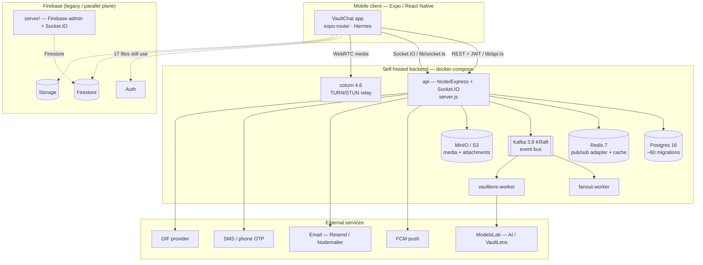
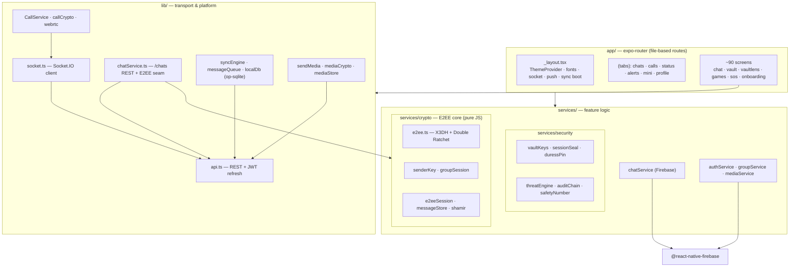
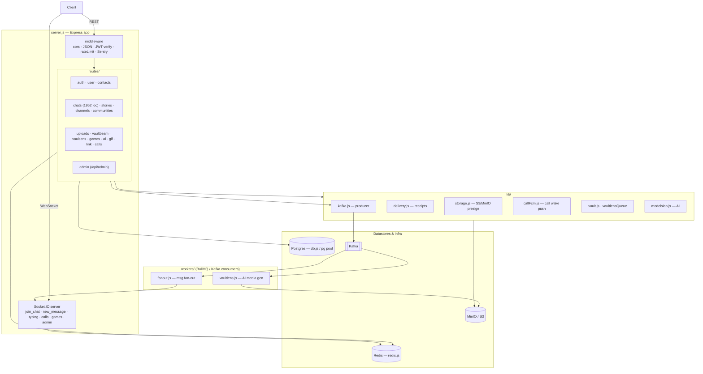
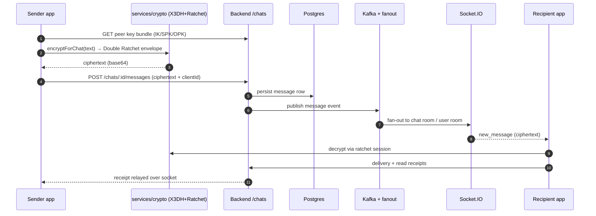

# VaultChat — Architecture

> Reverse-engineered from source. Every claim below is grounded in the actual
> files (`server.js`, `routes/*`, `services/crypto/*`, `lib/*`,
> `constants/flags.ts`, `docker-compose.yml`) — nothing inferred.

VaultChat is a security-first encrypted messenger in three parts:

1. **Client** — Expo / React Native 0.81 app (`app/` via `expo-router`: 6 tabs +
   ~90 stack screens).
2. **Primary backend** — `vaultchat-backend/`, an Express + Socket.IO monolith on
   Postgres / Redis / Kafka / S3, Dockerized behind `https://api.corefinite.com`.
3. **Legacy Firebase plane** — still wired into part of the app (Auth / Firestore /
   Storage) plus a separate `server/index.js` Firebase-admin + Socket.IO server.

| | |
|---|---|
| App version | `1.1.0`, `main: expo-router/entry` |
| Runtime | React Native 0.81 · Expo 54 · Hermes · TypeScript |
| Backend | Node ≥18 · Express 4 · Socket.IO 4 |
| Datastores | Postgres 16 · Redis 7 · Kafka 3.8 (KRaft) · MinIO/S3 |
| E2EE | X3DH + Double Ratchet (`E2EE_ENABLED` + `E2EE_STRICT` = true) |
| Scale of surface | 16 route modules · ~60 SQL migrations |

---

## ⚠️ Key finding: two coexisting data planes

The app is **mid-migration** between two backends, and both are live in the code:

- **Primary (custom backend)** — `constants/server.ts` → `api.corefinite.com`;
  `lib/api.ts` (REST + JWT in SecureStore) and `lib/socket.ts` (Socket.IO).
  `lib/chatService.ts` posts messages to the `/chats` REST routes. **30 files**
  import `lib/api`.
- **Legacy (Firebase)** — **17 files** under `services/` and `lib/` still import
  `@react-native-firebase` (Auth / Firestore / Storage). `services/chatService.ts`
  writes messages *directly to Firestore*. A separate `server/index.js` runs a
  Firebase-admin + Socket.IO server.

So `services/chatService.ts` (Firestore) and `lib/chatService.ts` (REST backend)
are parallel implementations of the same concept. Treat the Firebase plane as
legacy-but-not-dead.

---

## 01 · System context & deployment

`docker-compose.yml` services: `postgres`, `redis`, `kafka`, `minio`, `api`,
`coturn`, `vaultlens-worker`, `fanout-worker` (volumes: `pgdata`, `redisdata`,
`kafkadata`, `miniodata`).

---

## 02 · Client architecture

`app/_layout.tsx` boots the app: `ThemeProvider`, fonts, Socket.IO, push
(`notifee` + `lib/push`), E2EE identity provisioning, `syncEngine`, receipts,
media outbox, and Sentry.

---

## 03 · Backend architecture

Socket.IO uses a Redis adapter (`@socket.io/redis-adapter`) so
`io.to(room).emit(...)` reaches sockets across processes.

### Route modules (`vaultchat-backend/routes/`)

| Mount | Module | Responsibility | Size |
|---|---|---|---|
| `/auth` | auth.js | Register / login, JWT issue+refresh, phone OTP, onboarding, prekeys | 890 |
| `/user` | user.js | Profile, devices, privacy, backup keys, security events | 1651 |
| `/chats` | chats.js | **Core messaging** — chats, messages, reactions, receipts, polls | 1952 |
| `/uploads` | uploads.js | Attachment upload / S3 presign / retention | 421 |
| `/stories` | stories.js | Stories with story keys, text-status | 384 |
| `/channels` | channels.js | Creator channels + realtime broadcast | 238 |
| `/contacts` | contacts.js | Contact sync (peppered phone hash), discoverability | 234 |
| `/vaultbeam` | vaultbeam.js | Device-to-device large file transfer | 232 |
| `/vaultlens` | vaultlens.js | AI media generation queue | 192 |
| `/api/admin` | admin.js | Admin dashboard API (`admin/index.html`) | 245 |
| `/communities` `/call` `/link` `/gif` `/games` `/ai` | communities · calls · link · gif · games · ai | Communities, call wake/signaling, link preview, GIF, games, AI | 82–132 |

---

## 04 · Message send flow (1:1, E2EE)

With `E2EE_ENABLED` + `E2EE_STRICT` both **true** (`constants/flags.ts`), the
server only ever sees ciphertext for direct chats; a missing peer key bundle
makes the send fail-and-retry rather than leak plaintext.

**Not yet enforced:** group chats send *graceful plaintext* (sender-key / group
E2EE is scaffolded in `services/crypto/senderKey.ts` + `groupSession` but not the
enforced path). Media-at-rest encryption is gated behind `MEDIA_E2EE` (default
off).

---

## 05 · Cryptography & security model

**Messaging E2EE (`services/crypto/`)**
- `e2ee.ts` — real X3DH key agreement + Double Ratchet, built on `@noble/curves`,
  `@noble/hashes`, `@noble/ciphers` (same code runs in Node + Hermes).
- `e2eeSession(.rn)` — session bootstrap & SecureStore persistence.
- `senderKey` / `groupSession` — group sender-keys (scaffold).
- `shamir.ts` — Shamir secret sharing for key recovery.
- 47 self-tests (`*.selftest.ts`) run under Node + Hermes.

**Device / vault security (`services/security/`)**
- `vaultKeys`, `sessionSeal` — session sealed under the unlock PIN.
- `duressPin` / `duressVault` — decoy vault on a coercion PIN.
- `threatEngine`, `securityScore`, `auditChain`.
- `safetyNumber` — Signal-style contact verification.
- Backend: Argon2 / bcrypt hashing, JWT, Postgres RLS migrations.

**Feature flags (`constants/flags.ts`)**

| Flag | Default | Gates |
|---|---|---|
| `E2EE_ENABLED` | **on** | 1:1 X3DH + Double Ratchet |
| `E2EE_STRICT` | **on** | Never silently sends plaintext (fail + retry) |
| `VAULT_SESSION_SEALED` | off | Session tokens sealed under unlock PIN |
| `VAULT_CACHE_ENCRYPTED` | off | At-rest encryption of local SQLite cache |
| `MEDIA_E2EE` | off | Per-file AES-256-GCM media encryption |

---

## 06 · Notable subsystems

| Subsystem | Client | Backend / infra |
|---|---|---|
| **Voice / video calls** | `lib/CallService`, `callCrypto`, WebRTC shim, `incoming-call` / `voicecall` screens | `/call` route, `callFcm` wake-push, **coturn** TURN relay, socket signaling |
| **Games** (chess, ludo, poker, …) | ~22 boards in `components/games/`, `gameEngines.ts` | `/games`, `gameStore.js`, socket game rooms + match queue |
| **VaultLens** (AI media) | `vaultlens` screens, catalog | `/vaultlens`, queue → `vaultlens-worker` → ModelsLab |
| **VaultBeam** (P2P transfer) | `vaultBeamTransfer`, native stream plugin | `/vaultbeam` route, chunked transfers |
| **Stories / Status** | `(tabs)/status`, `StoryRing` | `/stories`, story keys, fan-out worker |
| **Offline / sync** | `op-sqlite` localDb, `syncEngine`, `messageQueue`, `mediaOutbox` | REST reconciliation + socket catch-up |
| **Push** | `notifee`, `lib/push` | `push.js` → FCM, device FCM tokens |

---

## 07 · Tech stack summary

**Client** — React Native 0.81 · Expo 54 · expo-router · TypeScript · Socket.IO
client · op-sqlite · Sentry · Firebase RN SDK · TensorFlow.js (blazeface /
mobilenet for face auth) · ethers (decentralized-id) · `@noble` crypto.

**Backend & infra** — Node ≥18 · Express 4 · Socket.IO 4 (+ Redis adapter) ·
Postgres 16 (pg) · Redis 7 (ioredis) · Kafka (kafkajs) · BullMQ · MinIO / AWS S3 ·
firebase-admin · Argon2 / bcrypt · JWT · coturn · Docker Compose · PM2 · Sentry.
