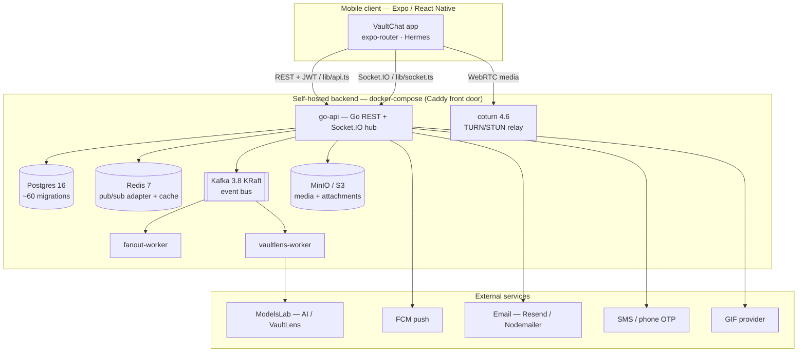
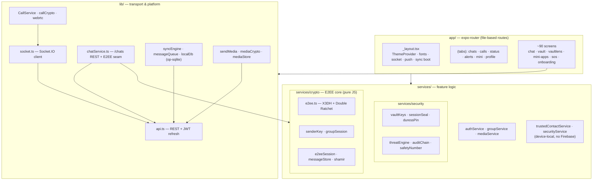
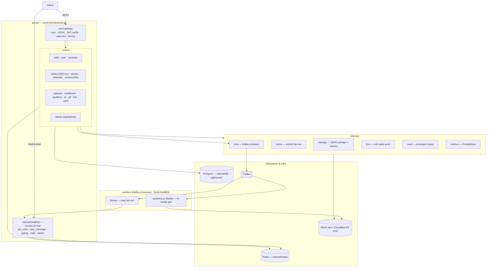
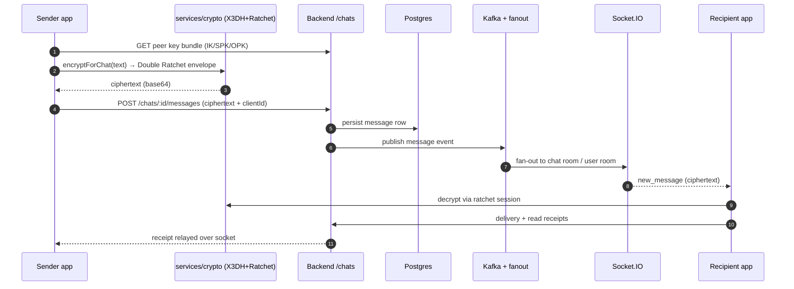

# VaultChat — Architecture

> Reverse-engineered from source. Every claim below is grounded in the actual
> files (`vaultchat-backend-go/`, `routes/*`, `services/crypto/*`, `lib/*`,
> `constants/flags.ts`, `docker-compose.yml`, `caddy/Caddyfile`) — nothing
> inferred.
>
> Last reconciled: 2026-08-02. Two sections of this document were stale for
> several months (a "legacy Firebase plane" that no longer exists, and a Node
> backend that has since been superseded by Go); both are corrected below.

VaultChat is a security-first encrypted messenger in two parts:

1. **Client** — Expo / React Native 0.81 app (`app/` via `expo-router`: 6 tabs +
   ~90 stack screens).
2. **Backend** — `vaultchat-backend-go/`, a Go service owning all 16 REST
   modules **and** the Socket.IO layer, on Postgres / Redis / Kafka / S3,
   Dockerized behind `https://api.corefinite.com`.

| | |
|---|---|
| App version | `1.1.0`, `main: expo-router/entry` |
| Runtime | React Native 0.81 · Expo 54 · Hermes · TypeScript |
| Backend | Go · Socket.IO hub · Caddy front door |
| Datastores | Postgres 16 (via pgbouncer) · Redis 7 · Kafka 3.8 (KRaft) · MinIO dev / Cloudflare R2 prod |
| E2EE | X3DH + Double Ratchet (`E2EE_ENABLED` + `E2EE_STRICT` = true) |
| Scale of surface | 16 route modules · ~65 SQL migrations |

---

## Data plane: one backend, Go

The Node→Go strangler migration is **complete for the client-facing surface**
(`vaultchat-backend-go/MIGRATION.md`). Go owns every REST module and the
realtime layer; `caddy/Caddyfile` is the switch, with two-line per-route
rollback to Node if a regression appears.

`vaultchat-backend/` (Node) is retained for **background jobs only** — the
VaultLens BullMQ render worker and its QueueEvents listener, which push results
into Go's sockets over the reverse bridge (`/internal/emit`,
`/internal/chat-event`, key-guarded and refused from outside by Caddy).

> **Implication for any new endpoint:** prod serves from Go. A route added only
> to `vaultchat-backend/routes/*.js` is dead in production. This has already
> bitten once — VaultView's revoke endpoint 404'd until `uploads.go` caught up
> (commit `d618639`).

### Firebase: removed

The legacy Firebase plane is **gone**. Nothing in the app imports
`@react-native-firebase` or the `firebase` web SDK. The last two consumers were
retired on 2026-08-02:

- `services/securityService.ts` — Firestore threat/screenshot mirrors. Both were
  already inert: they read identity from `auth().currentUser`, and nothing has
  signed in to Firebase Auth since the JWT cutover, so every write early-returned
  on a null uid. `services/security/auditChain.ts` is the real record.
- `services/trustedContactService.ts` — QR safety-number verification. Same null-uid
  problem, which made `isContactVerified()` return false unconditionally and left
  VaultBeam's "trusted contacts only" auto-download failing closed. Verifications
  now live on-device (correct for a per-device attestation) keyed off the JWT session.

**Firebase is not fully gone from the build**: push notifications use the *native*
FCM SDK (`com.google.firebase:firebase-messaging`, added by
`plugins/withVaultChatCalls.js`), so `google-services.json` and the google-services
Gradle plugin must stay. The JavaScript SDKs were unused and have now been
REMOVED (`firebase` + the four `@react-native-firebase/*` packages, plus the four
`shims/firebase-*.js` they were Metro-redirected to). Nothing imported the entry
point of that chain, so none of it was ever bundled. The google-services Gradle
plugin comes from Expo's own default prebuild chain via app.json's
`android.googleServicesFile`, NOT from `@react-native-firebase/app` — verified
before removal, and guarded since by `scripts/prod-precheck.js`.

### Games: code removed, tables retained

The games platform was deleted on 2026-08-02 (~870 loc: `realtime/games.go`,
`routes/games.go`, Node `routes/games.js`, `gameStore.js`, the `server.js`
socket handlers, and the contract-suite entries). It was never reachable from
this client.

Migration `030_games.sql` and its `game_profiles` / `game_matches` tables are
**deliberately left in place**. Migrations are applied history — removing one
breaks replay on a fresh database — and dropping the tables would destroy real
coin balances and match records irreversibly. If the separate WebView games
deployment is also retired, dropping them is a follow-up migration and an
explicit data decision, not a side effect of deleting code.

---

## 01 · System context & deployment

`docker-compose.yml` services: `postgres`, `redis`, `kafka`, `minio`, `api`,
`coturn`, `vaultlens-worker`, `fanout-worker` (volumes: `pgdata`, `redisdata`,
`kafkadata`, `miniodata`).

---

## 02 · Client architecture

`app/_layout.tsx` boots the app: `ThemeProvider`, fonts, Socket.IO, push
(`notifee` + `lib/push`), E2EE identity provisioning, `syncEngine`, receipts,
media outbox, and Sentry.

---

## 03 · Backend architecture

Socket.IO uses a Redis adapter (`@socket.io/redis-adapter`) so
`io.to(room).emit(...)` reaches sockets across processes.

### Route modules (`vaultchat-backend-go/internal/routes/`, mirrored from `vaultchat-backend/routes/`)

| Mount | Module | Responsibility | Size |
|---|---|---|---|
| `/auth` | auth.js | Register / login, JWT issue+refresh, phone OTP, onboarding, prekeys | 890 |
| `/user` | user.js | Profile, devices, privacy, backup keys, security events | 1651 |
| `/chats` | chats.js | **Core messaging** — chats, messages, reactions, receipts, polls | 1952 |
| `/uploads` | uploads.js | Attachment upload / S3 presign / retention | 421 |
| `/stories` | stories.js | Stories with story keys, text-status | 384 |
| `/channels` | channels.js | Creator channels + realtime broadcast | 238 |
| `/contacts` | contacts.js | Contact sync (peppered phone hash), discoverability | 234 |
| `/vaultbeam` | vaultbeam.js | Device-to-device large file transfer | 232 |
| `/vaultlens` | vaultlens.js | AI media generation queue | 192 |
| `/api/admin` | admin.js | Admin dashboard API (`admin/index.html`) | 245 |
| `/communities` `/call` `/link` `/gif` `/ai` | communities · calls · link · gif · ai | Communities, call wake/signaling, link preview, GIF, AI | 82–132 |

---

## 04 · Message send flow (1:1, E2EE)

With `E2EE_ENABLED` + `E2EE_STRICT` both **true** (`constants/flags.ts`), the
server only ever sees ciphertext for direct chats; a missing peer key bundle
makes the send fail-and-retry rather than leak plaintext.

Group chats are ALSO encrypted: `GROUP_E2EE` has been on since 2026-06-28, using
Signal-style sender keys (`services/crypto/senderKey.ts` + `groupSession`)
distributed over the pairwise Double Ratchet. Media-at-rest (`MEDIA_E2EE`) and
per-viewer story encryption (`STORY_E2EE`) are on as of the same date. This
paragraph previously described all three as unshipped scaffolding; that was
stale — `constants/flags.ts` is the source of truth.

---

## 05 · Cryptography & security model

**Messaging E2EE (`services/crypto/`)**
- `e2ee.ts` — real X3DH key agreement + Double Ratchet, built on `@noble/curves`,
  `@noble/hashes`, `@noble/ciphers` (same code runs in Node + Hermes).
- `e2eeSession(.rn)` — session bootstrap & SecureStore persistence.
- `senderKey` / `groupSession` — group sender-keys (scaffold).
- `shamir.ts` — Shamir secret sharing for key recovery.
- 47 self-tests (`*.selftest.ts`) run under Node + Hermes.

**Device / vault security (`services/security/`)**
- `vaultKeys`, `sessionSeal` — session sealed under the unlock PIN.
- `duressPin` / `duressVault` — decoy vault on a coercion PIN.
- `threatEngine`, `securityScore`, `auditChain`.
- `safetyNumber` — Signal-style contact verification.
- Backend: Argon2 / bcrypt hashing, JWT, Postgres RLS migrations.

**Feature flags (`constants/flags.ts`)**

| Flag | Default | Gates |
|---|---|---|
| `E2EE_ENABLED` | **on** | 1:1 X3DH + Double Ratchet |
| `E2EE_STRICT` | **on** | Never silently sends plaintext (fail + retry) |
| `VAULT_SESSION_SEALED` | off | Session tokens sealed under unlock PIN |
| `VAULT_CACHE_ENCRYPTED` | off | At-rest encryption of local SQLite cache |
| `MEDIA_E2EE` | **on** | Per-file AES-256-GCM media encryption |
| `STORY_E2EE` | **on** | Per-viewer wrapped story content key |
| `GROUP_E2EE` | **on** | Sender-key group encryption |
| `SCHEDULED_LOCAL` | off | On-device scheduled queue vs. server-side delivery |
| `VB_AUTODOWNLOAD` | off | VaultBeam auto-accept per user policy |
| `VB_RELIABILITY_FIXES` | **on** | Relay watchdog + recipient on-disk resume |
| `CALL_ENGINE_V2` | off | Consolidated call engine (`lib/call/`) — **unvalidated on hardware** |

---

## 06 · Notable subsystems

| Subsystem | Client | Backend / infra |
|---|---|---|
| **Voice / video calls** | `lib/CallService`, `callCrypto`, WebRTC shim, `incoming-call` / `voicecall` screens | `/call` route, `callFcm` wake-push, **coturn** TURN relay, socket signaling |
| **Games** | **Removed.** Never in the app — `components/games/` never existed and no client code referenced the surface; `app/(tabs)/mini.tsx` notes games ship as a separate WebView deployment | Server-side games code deleted 2026-08-02 (~870 loc across Go + Node). The `game_profiles` / `game_matches` tables from migration `030_games.sql` are LEFT IN PLACE — see note below |
| **VaultLens** (AI media) | `vaultlens` screens, catalog | `/vaultlens`, queue → `vaultlens-worker` → ModelsLab |
| **VaultBeam** (P2P transfer) | `vaultBeamTransfer`, native stream plugin | `/vaultbeam` route, chunked transfers |
| **Stories / Status** | `(tabs)/status`, `StoryRing` | `/stories`, story keys, fan-out worker |
| **Offline / sync** | `op-sqlite` localDb, `syncEngine`, `messageQueue`, `mediaOutbox` | REST reconciliation + socket catch-up |
| **Push** | `notifee`, `lib/push` | `push.js` → FCM, device FCM tokens |

---

## 07 · Tech stack summary

**Client** — React Native 0.81 · Expo 54 · expo-router · TypeScript · Socket.IO
client · op-sqlite · Sentry · react-native-vision-camera + expo-face-detector
(face auth) · ethers (decentralized-id, reached only by `constants/vaultID.ts`) ·
`@noble` crypto. No TensorFlow.js — an earlier revision of this document listed
it; it is not and was not a dependency.

**Backend & infra** — Go (all REST + Socket.IO) · Redis adapter ·
Postgres 16 (pg) · Redis 7 (ioredis) · Kafka (kafkajs) · BullMQ · MinIO / AWS S3 ·
Argon2 / bcrypt · JWT · coturn · Caddy · Docker Compose · Sentry. Native FCM
(`firebase-messaging`) for push wake-up.
