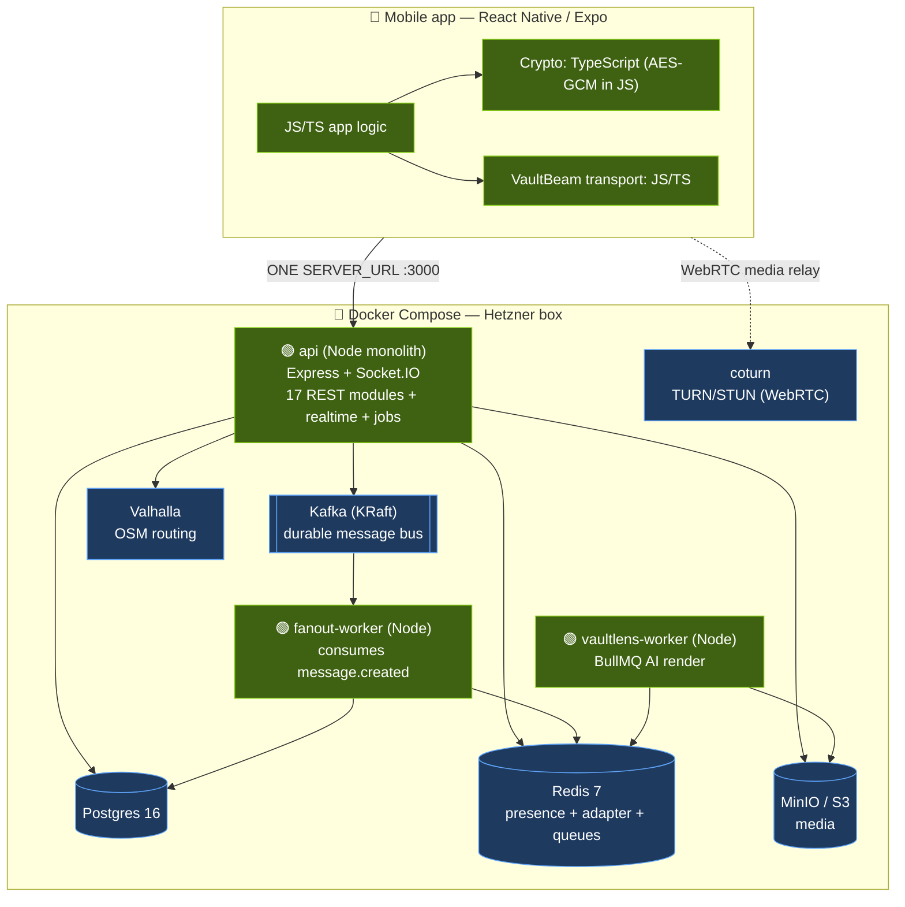
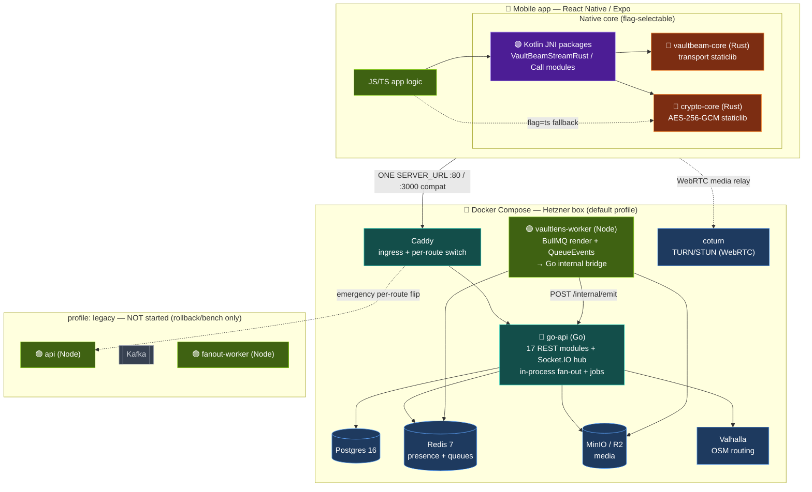
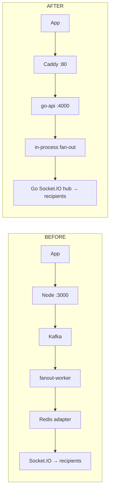

# VaultChat — Deployment Architecture: Before → After

This document captures how VaultChat's deployment shape changed with the recent
tech-stack migration:

- **Backend:** Node.js monolith → **Go-first** (`go-api` owns 100% of the client
  surface; Node survives only as a background render worker).
- **Mobile native core:** JS/TS crypto + transport → **Rust** (`crypto-core`,
  `vaultbeam-core`) bridged into Android via **Kotlin** JNI packages (and iOS via
  an xcframework).
- **Event/messaging substrate:** Kafka + Node fan-out workers → **in-process
  fan-out in Go** (Kafka retired to a `legacy` profile).

Both states run under **Docker Compose** on the same Hetzner box. The diagrams
below render natively on GitHub.

---

## 1. BEFORE — Node monolith (Dockerized)

One Node process (`server.js`, Express + Socket.IO) served every REST route, the
realtime layer, and all background jobs. Kafka was the durable bus and a separate
Node `fanout-worker` delivered messages over the Redis Socket.IO adapter. The
mobile app did crypto and VaultBeam transport in **TypeScript/JS**.



**Characteristics**
- Node owns REST + Socket.IO + jobs in one image (also runnable bare-metal under
  `pm2` per `ecosystem.config.js` — the pre-Docker lineage).
- Message delivery: `Kafka → fanout-worker → Redis adapter`.
- Crypto and VaultBeam transport execute in the JS engine on-device.

---

## 2. AFTER — Go-first (Dockerized) + Rust/Kotlin native mobile

`go-api` now serves **all 17 REST modules and the Socket.IO/WebSocket layer**.
Caddy is the single ingress and the per-route switch. Fan-out is **in-process in
Go** — Kafka and the Node `fanout-worker` are retired to a `legacy` profile (not
started). Node persists **only** as `vaultlens-worker`, whose QueueEvents listener
pushes `vaultlens:ready/failed` into Go's sockets via an internal bridge.

On device, crypto (`crypto-core`) and VaultBeam transport (`vaultbeam-core`) are
now **Rust** staticlibs, bridged into Android through **Kotlin** JNI packages
(`libvaultbeamnative.so`) and into iOS via an xcframework — selectable by feature
flag.



**Characteristics**
- Caddy `:80` (and `:3000` compat so existing APKs keep working) → `go-api :4000`.
- Message delivery: **in-process in Go** — no Kafka, no fan-out worker on the hot
  path.
- `/internal/*` is key-guarded (`INTERNAL_EMIT_KEY`) and Caddy refuses it from
  outside; it's how the Node worker feeds results back into Go's sockets.
- Instant rollback: uncomment a route's block in `caddy/Caddyfile` +
  `docker compose --profile legacy up -d api` to route it back to Node.

---

## 3. Request/message flow — side by side



---

## 4. What changed, at a glance

| Layer | Before | After |
|---|---|---|
| **Client surface (REST + realtime)** | Node `api` (Express + Socket.IO) | **Go** `go-api` (all 17 modules + Socket.IO) |
| **Ingress** | Direct to Node `:3000` | **Caddy** `:80` / `:3000` compat, per-route switch |
| **Message fan-out** | Kafka → Node `fanout-worker` → Redis adapter | **In-process in Go** |
| **Kafka** | Durable bus (active) | Retired to `legacy` profile (not started) |
| **Node's role** | Everything | **Only** `vaultlens-worker` (BullMQ render) |
| **On-device crypto** | TypeScript AES-GCM | **Rust** `crypto-core` staticlib (flag) |
| **On-device VaultBeam transport** | JS/TS | **Rust** `vaultbeam-core` staticlib (flag) |
| **Android native bridge** | — | **Kotlin** JNI packages → `libvaultbeamnative.so` |
| **iOS native bridge** | — | Rust **xcframework** |
| **Orchestration** | Docker Compose (Node monolith) | Docker Compose, Go-first default profile |
| **Background jobs** | Node `server.js` | Ported into `go-api` (`internal/jobs`) |

**Unchanged infra** (both states, same Docker Compose): Postgres 16, Redis 7,
MinIO/R2 object storage, Valhalla routing, coturn TURN/STUN.

---

## 5. Deploy commands

**Before (Node monolith):**
```bash
docker compose up -d          # single Node api + kafka + fanout-worker + infra
```

**After (Go-first):**
```bash
docker compose -f docker-compose.yml -f docker-compose.prod.yml up -d --build
# default profile = caddy + go-api + postgres + redis + minio + valhalla +
# coturn + vaultlens-worker (Node). api / kafka / fanout-worker stay behind
# --profile legacy and are NOT started.
```

**Rust-enabled mobile build (opt-in via flags):**
```bash
EXPO_PUBLIC_CRYPTO_BACKEND=rust \
EXPO_PUBLIC_VAULTBEAM_NATIVE_BACKEND=rust \
  # then: cd android && ./gradlew assembleRelease
```

---

_Sources: `docker-compose.yml`, `docker-compose.prod.yml`, `DEPLOY_STEPS.md`,
`vaultchat-backend-go/MIGRATION.md`, `vaultchat-backend/DEPLOY_HETZNER.md`,
`services/vaultbeam/rust/Cargo.toml`, `plugins/vaultbeam-core-android/`._
