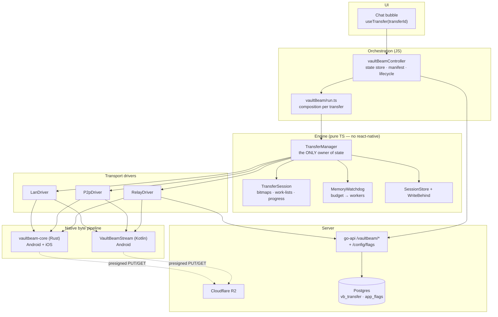
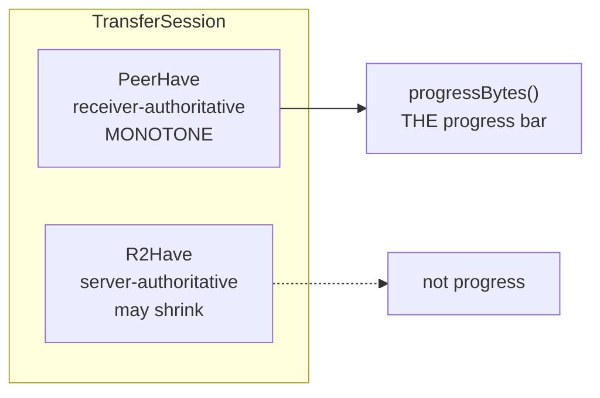
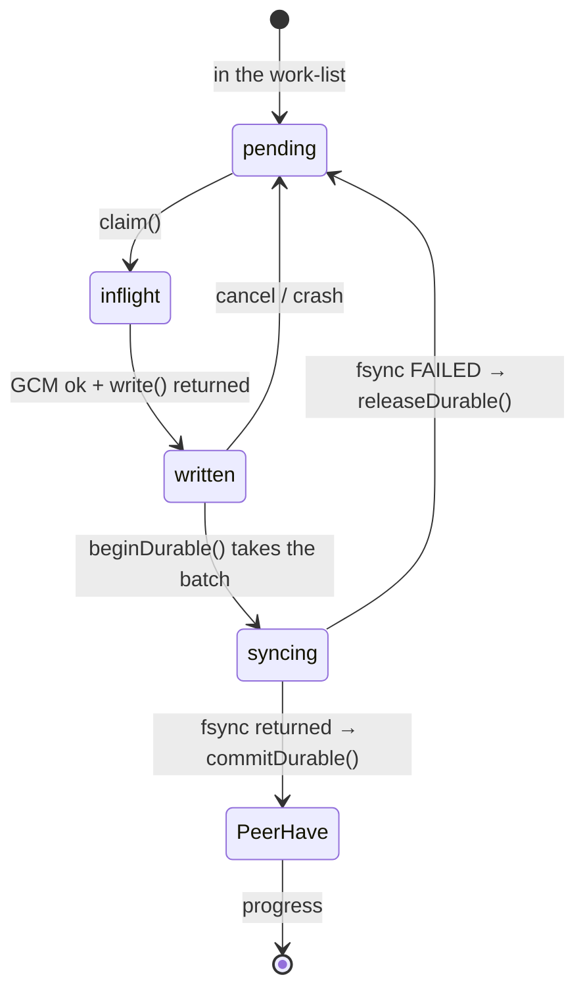
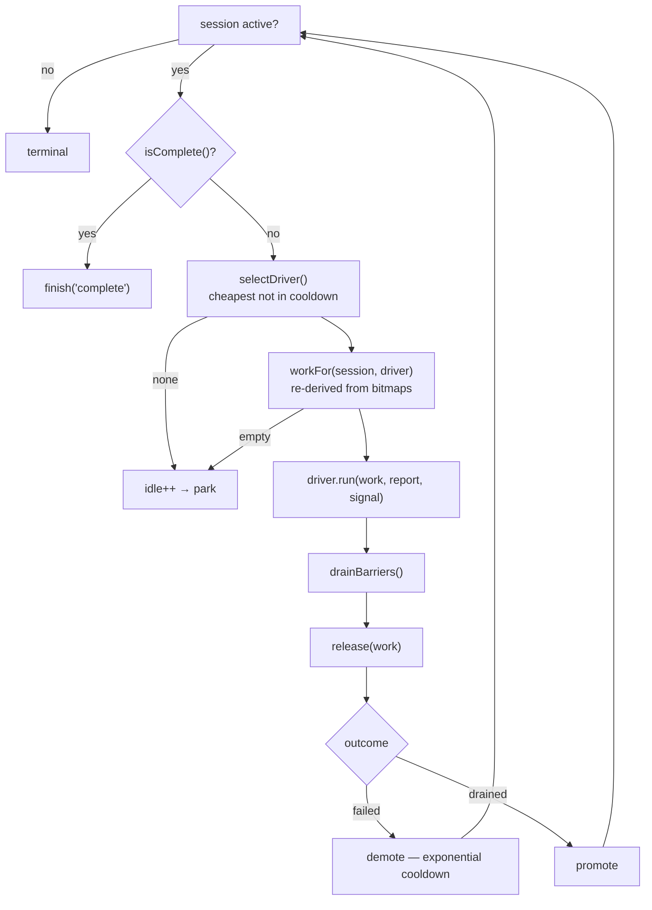
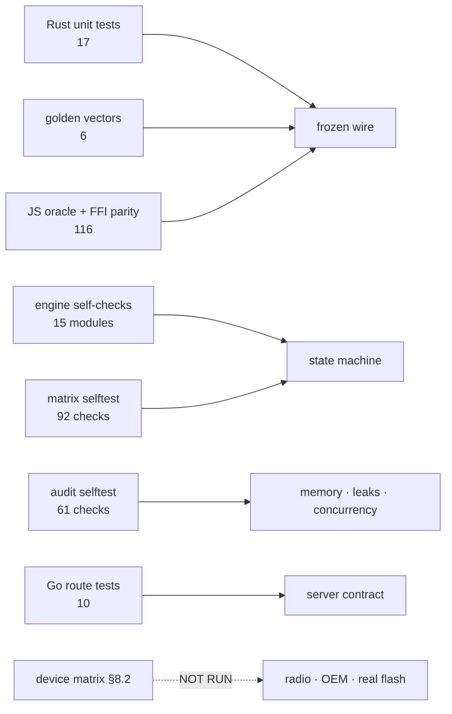

# VaultBeam — Complete Architecture

**Status:** as-built after Phases 1–5 of the final approved implementation order.
**Flag:** `VB_SEAMLESS_RESUME` — compiled default **off**, server-overridable.
**Not yet validated on a device.** See §16.

---

## 1. What VaultBeam is

VaultBeam moves large files (up to 12 GB) between two VaultChat users. The server
never sees plaintext: bytes are sealed on the sending device with AES-256-GCM and
opened on the receiving device, and the per-transfer key rides the existing E2EE
chat channel, never the transfer path.

It has four transports, tried cheapest-first:

```
LAN (native TCP)  →  WebRTC P2P  →  TURN  →  Cloudflare R2 relay
```

### 1.1 The problem this architecture exists to solve

The original implementation restarted the sender's upload **from 0%** whenever a
direct transport failed and the relay took over. A 10 GB file 90% delivered over
P2P re-uploaded all 10 GB.

The obvious fix — "don't reset the progress counter" — was not available, and this
is the fact the whole design turns on:

> Each transport used a **different chunk grid**. The relay's chunk id was derived
> from a per-segment byte offset; P2P's was a running counter. The same byte of the
> file had two different identities, sealed under two different nonces, acked by two
> different numbers. There was no shared vocabulary in which "the peer already has
> this" could even be *stated*, so a shared progress bitmap was not merely missing —
> it was **impossible**.

Everything below follows from fixing that first.

---

## 2. Layer map



The line that matters is between **Engine** and everything else. `lib/vaultBeam/*`
imports no react-native and no expo, which is why every component in it has an
executable self-check that runs under `npx tsx`. The composition root
(`wiring.ts` + `run.ts`) is the single place the pure world meets the platform.

---

## 3. Canonical chunk identity — the foundation

One grid, for every transport, forever.

| Property | Value |
|---|---|
| Logical chunk | **512 KiB** (`CHUNK_BYTES`), fixed |
| Chunk id | `plaintextOffset / 512 KiB` — a global index, nothing else |
| Nonce | `4B(transferId prefix) ‖ u64_be(chunkId)` — 12 bytes |
| AAD | `"<transferId>\|<fileId>\|<chunkId>"` |
| Wire | `ciphertext ‖ 16B GCM tag` |

Because the id is derived from the byte offset alone, it is **transport-invariant**:
LAN, P2P and the relay all name the same byte the same way. That is what makes a
single shared bitmap expressible.

### 3.1 Logical vs physical — the split that keeps both properties

| | Logical chunk | Physical block |
|---|---|---|
| Size | fixed 512 KiB | adaptive, **capped at 4 MiB** |
| Governs | encryption, ack, bitmap bit, resume unit | packing, request count, throughput |
| May change mid-transfer? | **never** | freely |

Changing the physical block size may change how many HTTP requests happen and
nothing else — never a chunk's identity, ciphertext, ack id, or bitmap bit. This is
asserted directly: the driver contract harness runs the same transfer at two
different physical unit sizes and requires the set of moved chunks to be identical.

**Why 4 MiB is a hard cap.** Native residency is `physicalUnit × workers × 2`. At
64 MiB × 4 workers × 2 buffers that is 512 MiB — an OOM. The cap makes the worst
case 32 MiB. Raising it now fails a test (§14), not a device.

### 3.2 Two grids coexist during migration

`IdScheme` is three-way so readers can accept both worlds while writers commit to one:

| Scheme | Meaning |
|---|---|
| `Canonical` | id = global logical index (v2 segment plan) |
| `LegacyOffset` | id from per-segment byte offset (v1 plan) |
| `Uniform` | `blockIndex × chunksPerBlock` (constant-geometry legacy) |

The **plan carries the scheme** (`idSchemeForPlan`), so a new build reads v1 *and*
v2. `blockMap` deliberately returns `null` for a v1 plan rather than reinterpreting
it as canonical — a mismatch is a clean reject, never a corrupt decrypt.

---

## 4. TransferSession — the state model

One session per transfer, for the transfer's whole life, across every transport.

### 4.1 Two bitmaps, two different facts



- **`PeerHave`** — GCM-verified, written, **durable** on the receiving device.
  Union-only within a session version. There is deliberately **no `clear()` method
  on `ChunkBitmap`**, so monotonicity is structural rather than a rule someone has to
  remember.
- **`R2Have`** — the relay holds the ciphertext. Rebuilt wholesale from the server's
  `uploaded_mask`, because the relay legitimately purges staged blocks on completion.

Conflating these was root cause RC-4: `uploaded_mask` means *"on R2"* and was being
used as the completion oracle. **Only `PeerHave` moves progress.**

### 4.2 Work-lists are derived, never stored

```
sender  → upload  = ¬PeerHave ∧ ¬R2Have ∧ ¬held
either  → direct  = ¬PeerHave ∧ ¬held
recip.  → relay   = ¬PeerHave ∧  R2Have ∧ ¬held
```

`held` = in-flight **or** awaiting a durability barrier (§5).

Because the work-list is recomputed from the bitmaps on every round, **a transport
change is a no-op on state**. There is no "resume mode": a recovered session and a
fresh one go through exactly the same loop.

### 4.3 The five session rules

| | Rule |
|---|---|
| R1 | A driver may only **append** via `markVerified` / `markWritten` / `markStaged` |
| R2 | `PeerHave` is monotone within a session version |
| R3 | A transport change does not touch state; the work-list is re-derived |
| R4 | A failed driver is demoted; the session stays active |
| R5 | Terminal only on an empty work-list or an unrecoverable error |

---

## 5. Durability watermark

`write_all` returning does **not** mean the bytes are on disk — they are in the page
cache. Every read-back check passes, and a power cut still takes them. Marking a
chunk verified on that basis records "durably written" about data that is not, and
on resume the engine **correctly skips it**, leaving a silently corrupt file.

Closing the file is not enough either; the LAN receive path used to comment
"on disk (the RandomAccessFile is closed)".

### 5.1 Three tiers, one promotion path



- `_written` and `_syncing` are **memory only, never persisted** — for the same reason
  `_inflight` is not: after a crash neither is true, so those chunks are re-fetched.
- A barrier promotes **only the batch it took**. A write that races the fsync waits
  for the next barrier, because an fsync only promises what preceded it.
- A **failed** barrier returns its batch to the work-list and promotes nothing. A
  permanently failing barrier parks the session at zero progress — it never
  completes.
- `commitDurable` refuses to promote into a non-active session, so a barrier landing
  after a cancel cannot move progress.

### 5.2 Where it lives

The manager owns the barrier; **no driver changed**. A driver still calls
`report.verified(chunk)` and the manager decides what that means. This follows the
locked rule that the Transfer Manager is the only owner of state.

Applied to **recipients only** — a sender's verified bits are the peer's
acknowledgement, already durable on the peer's disk.

Batch = 32 chunks: one fsync per 16 MiB, bounding crash re-work at 16 MiB.

**Native primitive:** `fileio::sync_file` uses `sync_data` (fdatasync) rather than
`sync_all`, because the destination is preallocated with `set_len`, so size metadata
is already stable and only data extents need flushing.

Present on all four native surfaces: Rust (`syncFile` op), Kotlin
`VaultBeamStreamModule`, `VaultBeamStreamRustModule`, iOS `VaultBeamStreamRust`.

---

## 6. TransferManager — the single owner

Owns: session state, admission queue, retry/cooldown, resume, progress
notification, transport selection, the durability barrier.

Drivers own: **transport only.**



Deliberate properties:

- **Single-flight.** Two `start()` calls for one `transferId` share one promise and
  one session object.
- **Drivers are scoped per transfer.** A process-wide registry once served transfer B
  using transfer A's source file.
- **Drivers are disposed when the session ends, not per run.** Per-run disposal made
  any multi-round transfer stall at whatever the first round happened to move.
- **Idle detection snapshots the revision *before* the run.** The report callbacks
  advance it themselves, so comparing afterwards scored productive rounds as idle.
- **A terminal session accepts no further reports.** Native block ops and socket loops
  cannot be interrupted, so drivers keep reporting after `cancel()` returns.

---

## 7. Transport drivers

```ts
interface TransportDriver {
  id: string;
  cost: number;                      // LAN 10 < P2P 20 < relay 30
  channel: 'direct' | 'relay';
  unitChunks(session): number;       // physical packing — throughput only
  available(session): Promise<boolean>;
  run(session, work, report, signal): Promise<DriverOutcome>;
  dispose(): void;                   // idempotent
}

interface DriverReport {
  verified(chunk): void;   // the PEER durably holds it — the only progress path
  staged(chunk): void;     // the RELAY holds ciphertext — not delivery
}
```

Adding a transport (a CDN, Bluetooth, Nearby Share) is implementing this interface
and calling `manager.setDriversFor(...)`. Nothing else changes.

Compliance is **tested, not assumed**: `runDriverContract()` is a shared harness every
driver's self-check calls — it asserts no phantom reports, idempotent disposal, abort
honoured, no progress state on the driver, and physical-unit independence.

### 7.1 Gating

`gateUntilReady(driver, pred)` keeps a driver unavailable until its transport exists.
`graceGate(relay, 8s)` holds the relay back so the direct tiers get a chance —
otherwise the always-reachable relay wins every first round.

### 7.2 Relay driver

Wraps the existing byte path rather than reimplementing it. What changed: the
work-list comes from the bitmaps (so a chunk the peer already verified is never
staged again), the sender reports `staged` and never `verified`, and ordering is
ascending so the first block staged is one the receiver actually needs.

Concurrency comes from the memory budget (§8), capped further by battery state.

### 7.3 P2P driver — the wire

| Frame | Meaning |
|---|---|
| `{t:'w', runs}` | these are the chunk runs coming |
| `{t:'c', i, len}` | chunk `i` follows, `len` wire bytes |
| *binary* | 16 KiB SCTP-safe frames |
| `{t:'p', i}` | **ack by chunk id** |
| `{t:'x', stop}` | reader-side flow control (§9) |
| `{t:'eof'}` / `{t:'ack', have}` | end / closing set |

Acking **by chunk id** rather than by a running count is what defuses RC-6: every
verified chunk is credited individually, so losing the final ack costs nothing. It
used to discard the entire transfer.

---

## 8. Memory model

Every transport used to size itself independently and **nobody added the numbers up**.

```
workers = clamp(1, floor(budget / (2 × physicalUnit)), cores − 1)
budget  = 32 MiB
```

The factor of two is not padding: a worker holds the buffer it is writing **and** the
one it is filling next. Sizing for one is how a "safe" limit turns out to be exactly
half of what gets allocated.

**Cores are a ceiling, not an input.** Concurrency on a phone is bounded by how many
buffers can exist, not by how many things can compute. `cores − 1` survives only
because running more workers than can be scheduled buys nothing.

**Storage speed is deliberately excluded.** Nothing on the device reports it, and
inferring it from observed write latency measures congestion — how many workers are
already running — as much as the medium. A signal that moves with the thing it is
meant to control is a feedback loop, not a measurement.

| cores | 1 MiB blocks | 2 MiB | 4 MiB |
|---|---|---|---|
| 4 | 6 MiB | 12 MiB | 24 MiB |
| 8 | 14 MiB | 28 MiB | 32 MiB |
| 16 | 30 MiB | 32 MiB | 32 MiB |

A 16-core flagship allocates no more than a 4-core budget phone.

---

## 9. Reader-side backpressure

SCTP is reliable and ordered, so it never asks a sender to slow down for the
**receiver's** benefit — only for the network's. The P2P receiver reassembled 512 KiB
buffers into an unbounded promise array and held each until its write completed:
~100 MiB at 200 outstanding, with nothing stopping it at 200.

Two layers, because one is not enough:

1. **Cooperative** — the receiver sends `{t:'x', stop:1}` at budget and `stop:0` at
   half (hysteresis). The sender's wait is **bounded**: a sender blocked forever on a
   resume frame that was lost is a hang, not flow control.
2. **Unilateral** — past the budget the receiver **allocates nothing** and discards the
   chunk. It is never acked, so it stays in the work-list and returns on a later
   round. *A memory bound that depends on the peer cooperating is not a bound.*

The queue is a `Set` a settled write removes itself from, so its size is the live
backlog rather than a tally of the whole run.

**Also fixed:** `new Uint8Array(c.len)` took the length **from the peer** — an
allocation primitive handed to the other end. Clamped to `CHUNK_BYTES + 16`.

---

## 10. Cancellation

Native block ops and socket loops cannot be interrupted from JS; they own their
lifetime and resolve seconds later. So the guarantee is not "everything stops
instantly" — it is **a cancelled run credits nothing**:

| Layer | Behaviour on cancel |
|---|---|
| P2P receiver | stops accepting, then **waits** for writes already touching the file |
| LAN driver | late progress events and the late promise are dropped |
| Relay driver | a block op resolving after abort is not credited |
| Manager | refuses any report into a non-active session |
| Session | `commitDurable` refuses a barrier landing after cancel |
| Session | `finish()` drops every un-durable write |

---

## 11. Session versioning and key material

`session_version` is monotonic and server-held. It increments **only** on a material
reset — a re-init of the same `transfer_id`, or a replaced source file — never on a
transport change, crash, resume, or plan growth.

### 11.1 Why a bump demands a fresh `K_t`

A bump restarts chunk ids at 0, and the nonce is `4B(transferId) ‖ u64_be(chunkId)`.
Continuing under the old key would seal **different plaintext at already-used
nonces**. For AES-GCM that is not a weakening — it is a total break: the XOR of the
plaintexts falls out, and tag forgery follows.

So `adoptVersion(version, keyB64)` **requires** fresh material and throws on reuse or
absence. `K_t` lives in the E2EE manifest and cannot be derived by the receiver, so
a stale session closes every transport gate (a stale P2P round is exactly as unsafe
as a stale relay round) and ends `failed`. Only a new manifest carries the transfer
forward.

> **Defect found and fixed in Phase 5.** Node's `relay/init` bumped `session_version`
> and cleared `recv_mask`; **Go — the live backend — did neither**, hardcoding
> `sessionVersion := 1`. The entire safeguard was inert in production: the trigger was
> never sent, so the refusal above could never fire.

---

## 12. Persistence and crash recovery

| Persisted | Not persisted |
|---|---|
| `PeerHave`, `R2Have` (tagged encoding) | `_inflight` |
| `session_version`, role, totalBytes | `_written`, `_syncing` |
| `state`, `lastTransport`, driver cooldowns | `K_t` (E2EE manifest only) |

`WriteBehind` coalesces ordinary progress at 1.5 s and flushes **immediately** on any
terminal or transport transition — both through the same call, so a caller cannot
forget one.

Bitmap encoding picks the smaller of RLE and base64. A 12 GB transfer with worst-case
alternating holes encodes to **4098 bytes**.

`recoverAll()` rebuilds every non-terminal session on launch and drops rows with no
key material or a vanished source. A **live session always wins** over its durable
snapshot, so a stale row cannot roll back live progress.

---

## 13. Server contract

### 13.1 Relay control plane (`go-api`, Go; Node kept as rollback target)

| Route | Purpose |
|---|---|
| `POST /vaultbeam/relay/init` | open/reset a transfer — **bumps `session_version`** |
| `POST /vaultbeam/relay/grow` | append a segment to the plan |
| `POST /vaultbeam/relay/block-url` | batch-presign R2 PUT/GET (≤64) |
| `POST /vaultbeam/relay/uploaded` | mark blocks staged |
| `POST /vaultbeam/relay/received` | receiver publishes `recv_mask` (**union-only**) |
| `GET /vaultbeam/relay/{id}` | plan + `uploaded_mask` + `session_version` |
| `POST /vaultbeam/relay/complete` | server-authoritative completion |
| `POST /vaultbeam/relay/abort` | purge + mark aborted |

Completion is **server-authoritative and immutable from that instant**, regardless of
whether the sender was ever told. A completion claim carrying a mask must cover every
chunk or it is a 409.

The server never sees plaintext, filenames, or `K_t`. `uploaded_mask` and `recv_mask`
are positions and sizes only.

### 13.2 Remote flag channel

`GET /config/flags?build=N`, unauthenticated by design — it is fetched during boot,
and `lib/api.ts` bounces a user to onboarding on a failed token refresh, so a flag
lookup on the auth path could log somebody out. Identity is the `X-Device-Id` header
the client already sends.

`app_flags` (migration 071) has three levers per key:

| Lever | Semantics |
|---|---|
| `killed` | emergency off — **outranks everything**, including 100% |
| `rollout_pct` | the dial: 0 → 1 → 10 → 25 → 50 → 100 |
| `min_build` | version floor — a v2 plan must never reach a build that cannot read it |

Bucketing is `sha256(key ‖ ':' ‖ deviceId) mod 100`, **server-side**: client bucketing
cannot be hotfixed, because the only devices that could correct it are the ones
running the bad code. The key is mixed in so one cohort does not absorb every
experiment's risk. Since the bucket depends only on its inputs, **raising the dial only
ever adds devices**. Go and Node are pinned together by a shared bucket fixture.

---

## 14. Rollout control plane

**Failure means the compiled default.** No server, no network, no row, a 500, a
malformed payload, an over-stale cache — all resolve to the constant in the build. The
channel can only move a flag where an operator explicitly set it; it can never fail a
fleet *onto* an untested path.

The staleness cap is separate from the TTL on purpose: the TTL says "serve this
without asking", the cap says "stop believing it" — which is what closes the hole where
an offline device honours a stale `true` after the flag was killed.

### 14.1 The per-transfer snapshot

A dynamic flag can move between a transfer's start and its resume, and the v1/v2 grids
are not interchangeable. So:

- the **sender** freezes its decision into `PersistedSend`; a resume replays it;
- the **recipient gets no vote at all** — the plan the sender published decides. The
  legacy receiver reads a v2 plan correctly (`idSchemeForPlan`); a seamless receiver
  facing a v1 plan finds no addressable blocks, so that pairing is eliminated rather
  than handled.

### 14.2 Signals — the cohort label is already in the data

A seamless sender writes a **v2** plan, a legacy sender writes **v1**, and the server
already stores it. No new client telemetry, no new privacy surface.

`vaultbeam_{started,completed,aborted,version_bump}_{v1,v2}` plus
`staged_blocks ÷ total_blocks` per cohort.

The staged-block ratio is **not a bug detector in isolation** — a transfer that never
found a direct tier legitimately stages every block. It is meaningful only as a
comparison: v2 should be *lower* (that saving is the point); if v2 is *higher*,
something is re-staging.

### 14.3 The dial

`scripts/vaultbeam-rollout.js` refuses to raise the percentage with no `min_build`, to
use an off-ladder value, or to skip a rung. It **never** refuses `kill` — an emergency
lever with preconditions is not an emergency lever — and never restricts a rollback.
The guards are a pure function with 40 tests, because they are the decisions that get
made under pressure.

A kill stops **new** transfers only; an in-flight one finishes on its own terms rather
than abandoning a half-written file on someone's disk.

---

## 15. Platform lifecycle

**Android 15 `dataSync` is capped at six hours per 24 h across the whole app**, and that
budget is shared with the no-GMS socket connection — so a 12 GB transfer on a slow link
could be cut off well short of six.

`VaultBeamTransferJobService` schedules a **user-initiated data transfer job**, which is
outside that cap. `setNotification()` is mandatory for such a job — the system stops one
that does not call it — so while the job runs it **owns** the progress notification and
the Notifee one is suppressed rather than duplicated.

The job does not move bytes. It holds the process at foreground priority and gives the
transfer a user-cancellable identity; putting the transfer loop there would create a
second owner of transfer state.

Degrades rather than fails: below API 34, or when the system refuses the schedule, the
`dataSync` path runs exactly as before. A *transient* refusal is retried; only an
unsupported platform latches.

---

## 16. Verification topology



Three independent checkers pin the wire format: Rust unit tests, a JS oracle
self-test, and an FFI parity suite driving `vb-cli` against the JS oracle. A change
to the ciphertext layout has to fool all three.

### 16.1 Full internal run — actual results

| Suite | Result |
|---|---|
| `tsc --noEmit` | **0 errors** |
| Rust `cargo test` | **17 lib + 6 vector, 0 failed** |
| Crypto parity (`npm run test:e2ee`) | **116 checks, 0 failed** |
| Engine self-checks (15 modules) | **all OK** |
| Audit selftest | **61 checks, 0 failed** |
| Transport matrix | **92 checks, 0 failed** |
| Go `build` / `vet` | **clean** |
| Go `internal/routes` | **all pass** (incl. cross-language bucket parity) |
| Node/plugin syntax (8 files) | **all parse** |
| Native surface parity (11 methods × 4 backends) | **complete** |
| `npm test` | **66/67** |
| `prod-precheck` | **all gates pass** |

Two items did **not** pass, neither caused by this work:

1. `services/security/deviceSecurity/nativeMap.selftest.ts` — pre-existing, unrelated
   (VaultShield APK re-sign baseline), last touched by commit `6d61c61`.
2. `internal/vault TestVaultInterop` — **environment**, not code: it shells out to the
   Node backend, whose `node_modules` are not installed in this container
   (`Cannot find module '@node-rs/argon2'`). Earlier reports in this work said "Go
   test clean" on the basis of `./internal/routes/` only; the full Go suite has this
   one environment-blocked test.

### 16.2 What the matrix does and does not cover

§8.2 called all 14 rows device-only because NAT traversal and LAN sockets are. That is
true of the **radio** — not of the state machine, which is where every bug in this work
actually lived.

| | Rows |
|---|---|
| Automated in full | 4, 6, 12, 14 |
| Automated at state-machine level | 1, 2, 3, 5, 8, 10, 11, 13 |
| **Device only** | 7 (background↔foreground), 9 (cold boot), and the radio/OEM half of every partial row |

Every automated row asserts all three invariants: progress never decreases, the
reassembled file is byte-exact, and a **chronological** ledger proves no
already-*delivered* chunk is handed to another transport.

---

## 17. Invariant reference

| # | Invariant | Enforced by |
|---|---|---|
| 1 | A chunk's identity is its plaintext offset ÷ 512 KiB | `chunkIdFor`, golden vectors |
| 2 | Physical block size never changes identity | driver contract harness |
| 3 | `PeerHave` is monotone within a version | no `clear()` exists on `ChunkBitmap` |
| 4 | Only verified bytes are progress | `progressBytes()` reads `PeerHave` alone |
| 5 | Staging on R2 is not delivery | separate `staged()` channel |
| 6 | Nothing is verified before it is durable | manager barrier + `sync_file` |
| 7 | A failed barrier promotes nothing | `releaseDurable` |
| 8 | A version bump requires fresh `K_t` | `adoptVersion` throws |
| 9 | A transport change never resets state | work-list re-derived each round |
| 10 | A terminal session gains no progress | manager + `commitDurable` guards |
| 11 | Receiver memory is bounded regardless of peer | unilateral hard cap |
| 12 | A peer-declared length is never trusted | clamped to `CHUNK_BYTES + 16` |
| 13 | Engine memory ≤ 32 MiB on any device | `planWorkers` + audit table |
| 14 | Remote-flag failure yields the compiled default | `flagEnabled` fallback chain |
| 15 | Kill outranks every other lever | `resolve()` ordering + tests |
| 16 | A v1 plan is never read as canonical | `blockMap` returns `null` |

---

## 18. Scale

| | LOC |
|---|---|
| Engine (`lib/vaultBeam/`) | 5,733 |
| Flag / job / rollout seam | 1,170 |
| Native (Rust + Kotlin + Swift) | 2,247 |
| Backend (Go + Node + SQL) | 466 |

Roughly 40% of the engine is executable self-check that runs in CI.

---

## 19. What is still open

**Blocking the flag flip:**

1. **§8.2 on real hardware.** Nothing here has run on a device. This has been true
   across every review in this project and no further work in CI changes it.
2. Migration 071 applied to the server the build talks to.
3. A build shipped with `RUN_USER_INITIATED_JOBS` + the job service, with `min_build`
   set to it.
4. `/internal/metrics` scraped with both cohorts side by side.

**Known and accepted:**

- A permanently failing durability barrier re-fetches for `maxIdleRounds` before
  parking. Bounded and correct, but it burns bandwidth on a full disk.
- A kill switch does not reach an in-flight transfer. Deliberate: abandoning a
  half-written file to protect against a bug that transfer has already survived is
  the worse outcome.
- Deleting the partial plaintext when a recipient transfer is abandoned (tasks.md
  7b.3) is not implemented.
- The relay cost at 4 MiB blocks is ~16× the 64 MiB alternative in R2 Class-A
  operations. Accepted deliberately in exchange for the memory ceiling.
