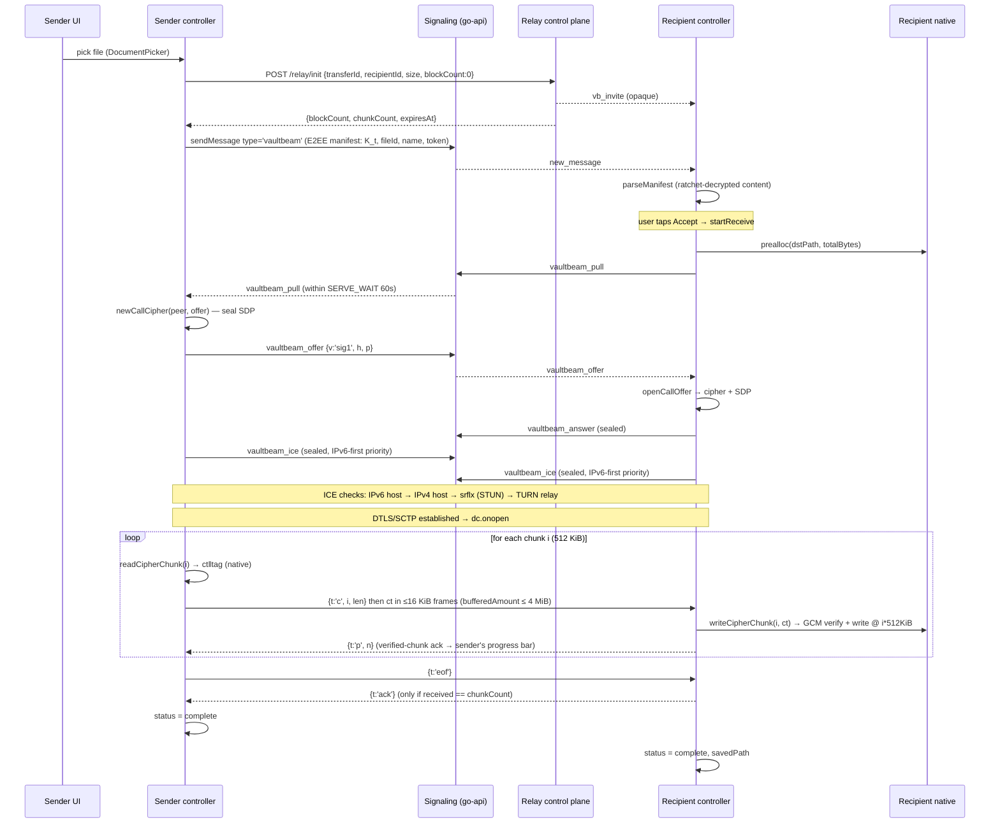
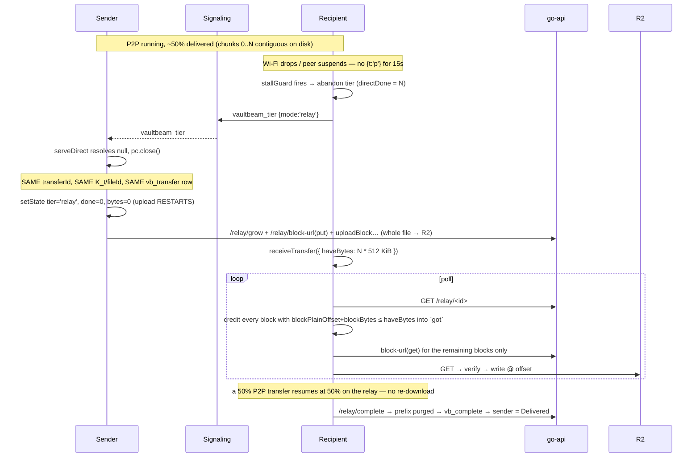
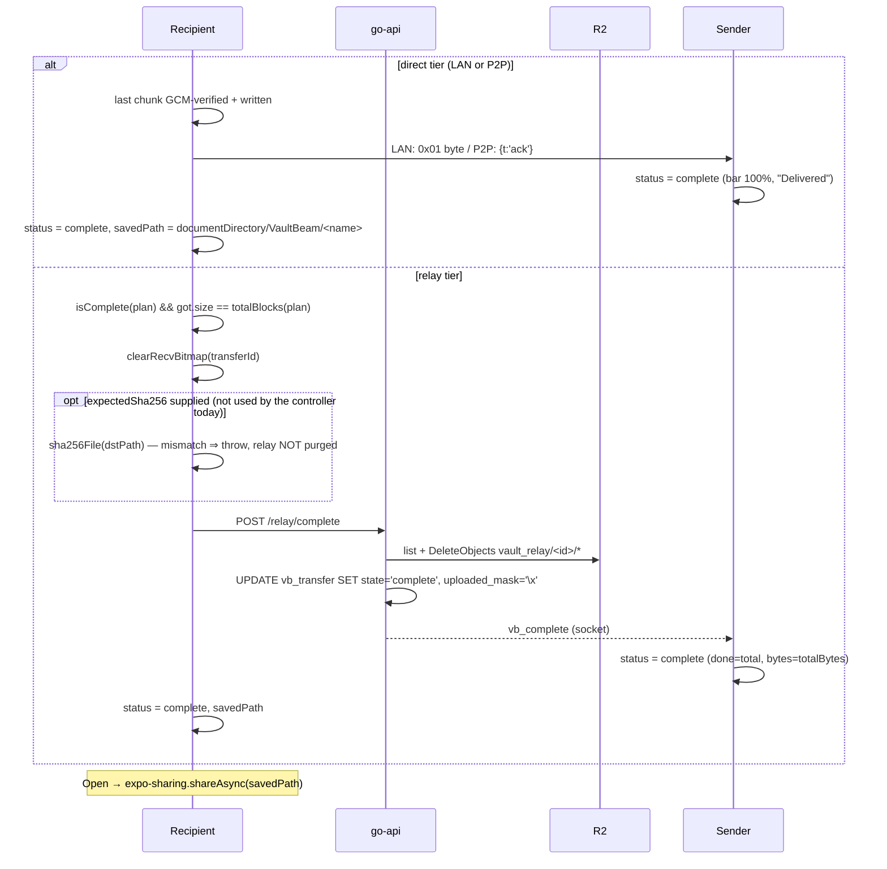

# VaultBeam — File Transfer Architecture Analysis (as-implemented)

A description of **exactly how the current code works**. No proposals, no redesign.
Every claim below is traceable to a file/line in this repo.

The file-transfer system is called **VaultBeam**. It is reachable from a 1:1 chat via
the composer's **"Big File"** attachment action (`app/chat.tsx:1794`), handles files up
to **12 GiB**, and moves them over three transports (LAN TCP → WebRTC P2P → Cloudflare
R2 relay) that all carry the *same* AES-256-GCM chunk format.

---

## 0. Component map and who talks to whom

| Component | Concrete code | Responsibility |
|---|---|---|
| **React Native (TS)** | `lib/vaultBeamController.ts`, `vaultBeamTransfer.ts`, `vaultBeamDirect.ts`, `vaultBeamSegments.ts`, `vaultbeamRelay.ts`, `components/VaultBeamBubble.tsx` | Orchestration only. Holds transfer IDs, block indices, presigned URLs, the segment plan, the progress store, tier selection, WebRTC signaling. **Never holds a file byte** (except one ≤512 KiB chunk base64 during P2P). |
| **Rust** | `services/vaultbeam/rust/src/{chunk,fileio,lan,ffi}.rs` (crate `vaultbeam-core`), exposed as `VaultBeamStreamRust` via `plugins/vaultbeam-core-android` (JNI/CMake) and `plugins/vaultbeam-core-ios` (Swift + xcframework) | Second, interchangeable native backend. Owns chunk crypto (delegating GCM to the Phase-1 `crypto_core::aead`), block layout, positional file I/O, sha256, and blocking LAN TCP. Explicitly does **not** own WebRTC, signaling, negotiation, or op-sqlite state. The only iOS-capable backend. See §10. |
| **Kotlin** | `plugins/android/VaultBeamStreamModule.kt` (`VaultBeamStream`) | Default native backend (Android). Same surface: `prealloc`, `uploadBlock`, `downloadBlock`, `sha256`, `deleteFile`, `readCipherChunk`, `writeCipherChunk`, `lanIp`, `lanServe`, `lanConnect`. All work on a 4-thread `Executors` pool. |
| **Go** | `vaultchat-backend-go/internal/routes/vaultbeam.go` + `internal/realtime/handlers.go` | The live backend (Caddy routes `/` → `go-api:4000`, `caddy/Caddyfile:49`). Serves the 7 relay control-plane endpoints and relays the `vaultbeam_*` socket events. Signs R2 presigned URLs with hand-rolled stdlib SigV4. |
| **Node (legacy/rollback)** | `vaultchat-backend/routes/vaultbeam.js`, `server.js:1005-1016` | Byte-compatible original of the same control plane; kept as the documented rollback target. |
| **WebRTC** | `@livekit/react-native-webrtc`, driven by `lib/vaultBeamDirect.ts` | Tier-2 transport. One `RTCDataChannel` named `vaultbeam`, `ordered: true`. |
| **Signaling server** | Socket.IO hub inside go-api (Node equivalent: `server.js`) | Opaque `to`-addressed relay of `vaultbeam_pull / ready / offer / answer / ice / tier / end`. Stamps the authenticated `from`. Never sees payload bytes; SDP/ICE are themselves sealed. |
| **Relay server** | **There is no byte-forwarding relay process.** "Relay" = Cloudflare R2 + the Go control plane. | The server issues presigned URLs and tracks a per-block bitmask. Bytes go device → R2 → device, never through the API process. |
| **Cloudflare R2** | `vault_relay/<transferId>/<blockIndex>` objects | Temporary ciphertext object store. Purged actively on complete/abort, plus a 24 h bucket lifecycle rule. |
| **Local database** | Postgres `vb_transfer` (server, migrations 057/058/060); op-sqlite `vb_transfers` (`lib/localDb.ts:118`); AsyncStorage keys `vc_vaultbeam_sends`, `vc_vb_recv_<id>`, `vc_netstate_v1`, `vc_vaultbeam_settings_v1` | Server table is content-free routing + bitmask + plan. Client SQLite mirrors UI state; AsyncStorage holds sender-resume records, the receiver block bitmap, and throughput history. |
| **Encryption layer** | `lib/callCrypto.ts` (signaling seal), `services/crypto/e2eeSession.rn` (X3DH + Double Ratchet), native GCM in Kotlin/Rust | Two independent layers: the E2EE chat message carrying the manifest, and per-chunk AES-256-GCM on every byte on every tier. |

**Communication edges**

```
RN (TS) ──HTTPS /vaultbeam/relay/*──▶ go-api ──SQL──▶ Postgres(vb_transfer)
RN (TS) ──Socket.IO vaultbeam_*────▶ go-api ──emitToUid(user:<uid>)──▶ peer RN
RN (TS) ──JSI/JNI bridge (metadata only)──▶ Kotlin|Rust native
native  ──HTTPS presigned PUT/GET──▶ Cloudflare R2      (file bytes, ciphertext)
native  ──raw TCP :ephemeral──▶ peer native             (file bytes, ciphertext, LAN)
RN (TS) ──SCTP DataChannel──▶ peer RN                   (file bytes, ciphertext, P2P)
```

---

## 1. The complete transfer flow, step by step

### 1.1 Sender selects a file
`app/chat.tsx:1723 onSendVaultBeam`. Guarded by: direct (1:1) chat only, and
`isNativeStreamAvailable()`. `DocumentPicker.getDocumentAsync({ copyToCacheDirectory: true })`
copies the picked file into the app cache and yields a real filesystem path plus
`asset.size`. A zero/unknown size aborts with an alert.

### 1.2 File preparation
`startSend` (`lib/vaultBeamController.ts:305`) validates:
- native module present,
- `size > 0`,
- `size <= MAX_BYTES` (12 GiB),
- `recipientId` present (1:1 only).

**No pre-encryption pass and no temp copy is made.** The source file is read in place,
chunk by chunk, at transfer time.

### 1.3 Transfer ID / key / file ID generation
All in `startSend`, from `@noble/hashes` `randomBytes`:
- `transferId = hex(16)` → 32 hex chars, satisfies the server's `^[A-Za-z0-9]{16,64}$`.
- `fileId = hex(16)` — binds the AAD to one file.
- `keyB64 = base64(randomBytes(32))` — the per-transfer AES-256 key **K_t**.
- `token = base64(randomBytes(16))` — LAN connect authenticator.

### 1.4 Session creation (relay row)
`relayInit(transferId, recipientId, size, chatId, blockCount = 0, plan = '')`
→ `POST /vaultbeam/relay/init`. The server (`vaultbeam.go:434`):
- rate-limits `vbinit:<uid>` at 20/60 s,
- rejects self-send, missing/blocked recipient, `>12 GiB`,
- computes `chunkCount = ceil(total/512 KiB)`,
- accepts the client `blockCount` (may be 0 — v2 adaptive) capped at `ceil(total/256 KiB)`,
- allocates an all-zero `uploaded_mask` BYTEA,
- inserts `vb_transfer` with `state='pending'`, `expires_at = now()+24h`,
- emits `vb_invite` to the recipient (opaque: ids + sizes only).

The row is **content-free**: no filename, mime, or key (migration 057 header).

### 1.5 Metadata generation (the manifest)
```ts
manifest = { v:'vbm2', keyB64, fileId, name, mime, size, token, plan? }   // E2EE
meta     = { vaultbeam:true, transferId, size }                            // plaintext
await sendMessage(chatId, JSON.stringify(manifest), 'vaultbeam', { meta })
```
`sendMessage` (`lib/chatService.ts:615`) runs `encryptForChat` — the X3DH + Double-Ratchet
seam — so the manifest ships as ratchet ciphertext inside `messages.content`. The
message row *is* the invite (WhatsApp model), so it persists, syncs offline, and
arrives live through the normal `new_message` pipeline. `messages.type='vaultbeam'` was
allowed by migration 058.

The version string is `vbm2`; `parseManifest` rejects anything else (a `vbm1` client
would mis-read the adaptive `plan` and fail every GCM open, so the bump is a hard reject
by design — `vaultBeamController.ts:36-40`).

### 1.6 Sender-crash resume record
`persistSend({transferId, srcPath, name, size, fileId, keyB64, linkType})` into
AsyncStorage `vc_vaultbeam_sends` (max 50). Dropped on any terminal state.

### 1.7 Tier selection — the sender serves direct first
`serveDirect(...)` (`lib/vaultBeamDirect.ts:144`) is awaited before any relay upload:

1. Opens a signaling **inbox** that buffers every `vaultbeam_*` frame for this
   `transferId` from this moment (so an early offer/ICE is never dropped).
2. Waits up to **`SERVE_WAIT_MS = 60 s`** for a `vaultbeam_pull` from the recipient.
   No pull → returns `null` → sender goes to the relay.
3. On pull, it starts **both** direct transports concurrently:
   - **LAN**: `lanIp()` + `lanServe({...})`. The native side binds a TCP `ServerSocket`
     on an ephemeral port and emits `vbLanBound{port}`; JS then emits
     `vaultbeam_ready {lanIp, lanPort}`.
   - **P2P**: builds an `RTCPeerConnection`, creates the `vaultbeam` datachannel,
     creates the offer, seals it, emits `vaultbeam_offer`.
4. Resolves `'lan' | 'p2p'` on a confirmed delivery, or `null` on
   `CONNECT_MS = 12 s` with nothing connected, on `vaultbeam_tier {mode:'relay'}`
   from the recipient, or on abort.

### 1.8 Signaling
Client `getSocket()` → Socket.IO. Server handler is a one-liner
(`server.js:941`, Go `handlers.go:253-259`):
```js
const relayToPeer = (event) => (data) => {
  if (!data?.to) return;
  emitToUid(data.to, event, { ...data, from: socket.data.uid, fromUid: socket.data.uid });
};
```
`emitToUid` publishes to the Socket.IO room `user:<uid>`, so every device of that user
on any cluster node receives it. Events used: `vaultbeam_pull`, `vaultbeam_ready`,
`vaultbeam_offer`, `vaultbeam_answer`, `vaultbeam_ice`, `vaultbeam_tier`.
(`vaultbeam_end` is registered server-side but no current client emits it.)

**Signaling is sealed.** `newCallCipher(peerId, offer)` (`lib/callCrypto.ts:92`) mints a
random 32-byte key, wraps it once through the Double Ratchet (`e2eeEncrypt`), and
returns `{ cipher, offerWire: {v:'sig1', h:<wrapped key>, p:<sealed offer>} }`. Every
subsequent ICE candidate and the answer are `cipher.seal(...)`. The recipient calls
`openCallOffer` to unwrap. Legacy/no-session peers pass through in plaintext; a sealed
offer that cannot be opened returns `offer:null` and the recipient falls straight to
relay.

### 1.9 WebRTC connection and ICE negotiation
`makePc(ice)` uses `iceCandidatePoolSize: 4` and `bundlePolicy: 'max-bundle'`.
ICE server list (`iceServers()` in `vaultBeamDirect.ts:84`):
- `stun:stun.cloudflare.com:3478` (dual-stack, prepended so an IPv6 srflx is found even
  though coturn's STUN is IPv4-only), then
- `getIceServers()` (`lib/iceConfig.ts`) → cached `GET /user/turn`.

`GET /user/turn` (`routes/user.go`) issues coturn REST credentials:
`username = "<expiry-unix>:<userId>"`, `credential = base64(HMAC-SHA1(TURN_SECRET, username))`,
TTL 24 h, returning `turn:<host>:3478?transport=udp|tcp` and `turns:<host>:5349?transport=tcp`,
plus Google STUN. If `TURN_SECRET` is unset the response is STUN-only.
`lib/iceCredentials.ts` caps caching at `min(credential expiry − 5 min, 1 h)`.

Both peers rewrite every candidate's priority through
`reprioritizeIceObject` (`lib/icePriority.ts`) — IPv6 host 65535 > IPv4 host 60000 >
IPv6 srflx 50000 > IPv4 srflx 40000 > IPv6 relay 15000 > IPv4 relay 10000 — so IPv6
direct pairs are checked before any TURN relay pair.

Two ordering rules the code enforces explicitly:
- **Remote ICE is buffered** until `setRemoteDescription` has been applied
  (`pendingIce` on both sides) — `react-native-webrtc` throws on `addIceCandidate`
  with no remote description and would silently drop the host candidate.
- **Outgoing ICE is buffered** until the cipher exists (`outIce`, `sealReady`) so no
  device IP ever egresses unsealed.

Winning-pair telemetry: `logIceWin` reads `pc.getStats()` and marks
`vaultbeam_ice_win {wonVia, direct, ipv6, rttMs}`.

### 1.10 STUN vs TURN — when each is used
- **STUN** is always in the list and is used during gathering to learn the
  server-reflexive candidate. It costs nothing and is tried whenever there is no
  direct host route.
- **TURN (coturn)** is only used when ICE cannot form a direct pair — symmetric
  NAT/CGNAT on both ends. It is deliberately the lowest priority tier. coturn is
  deployed as a host-networked container (`docker-compose.yml:262`) with
  `use-auth-secret`, ports 3478/5349 + relay range 49160-49200, and SSRF hardening
  (`denied-peer-ip` for all RFC1918/link-local/loopback ranges).
- TURN relays the **WebRTC datachannel**, i.e. tier-2 bytes. It is **not** the same
  thing as the "relay tier", which is R2.

### 1.11 P2P DataChannel creation and chunk transmission
Sender (`p2pSend`, `vaultBeamDirect.ts:349`), for `i` in `0..chunkCount-1`:
1. `readCipherChunk({srcPath, keyB64, transferId, fileId, chunkIndex:i, chunkBytes:512 KiB, chunkCount, totalBytes})`
   → native reads 512 KiB at `i*512 KiB`, seals it, returns base64 `ct‖tag`.
2. `dc.send(JSON.stringify({t:'c', i, len}))` — control frame.
3. The ciphertext is fragmented into **≤16 KiB binary frames** (`FRAME`) and sent, with
   backpressure: `while (dc.bufferedAmount > 4 MiB) await sleep(15)`.
4. After the last chunk: `dc.send({t:'eof'})`, then waits for `{t:'ack'}` up to
   `ACK_TIMEOUT_MS = 30 s`.

Receiver (`p2pReceive`): reassembles each chunk into a `Uint8Array(len)`, and when full
calls `writeCipherChunk({dstPath, chunkIndex:i, ctB64})` → native verifies the GCM tag,
decrypts, and writes plaintext at `i*512 KiB` into the preallocated file. Then it sends
`{t:'p', n:received}` — a **verified**-chunk progress ack — and on `eof` with
`received === chunkCount` sends `{t:'ack'}`.

At most one chunk's ciphertext (≤512 KiB + tag, base64) is in the JS heap at any moment.

### 1.12 LAN transmission (Tier 1)
Native on both sides (`VaultBeamStreamModule.kt:346/410`, `lan.rs`), zero JS heap:
```
receiver → [token bytes]                                (16-byte shared secret from the manifest)
sender   → repeated [i32_be chunkIndex][i32_be ctLen][ct‖tag]
receiver → [0x01]                                       (1-byte delivery ack)
```
Sender: `ServerSocket(0)`, `soTimeout = 45 s` waiting for the peer, `tcpNoDelay`,
flush + `vbLanProgress` every 16 chunks. Rejects a wrong token (`lan_auth`).
Receiver: `connect(host, port, 5 s)` — fails fast when not on the same LAN — validates
`16 <= ctLen <= chunkBytes+64`, decrypts, `seek(idx*chunkBytes)`, writes, and only after
every chunk is on disk writes the ack byte. The sender resolves success **only** on
`ack == 1`; otherwise it rejects `lan_noack`.

### 1.13 Relay transmission (Tier 3) — the adaptive block pipeline
`sendTransfer` (`lib/vaultBeamTransfer.ts:81`):
1. `loadState(linkType)` — the persisted EWMA throughput for `wifi/ethernet` ("fixed")
   vs everything else ("cellular").
2. `batteryParallelism()` — 4 concurrent block ops, halved to 2 on low-power mode or
   `<20 %` battery while not charging.
3. `relayState(transferId)` — resume basis: the existing `plan` and `uploadedMask`.
4. Loop until `isComplete(plan)`:
   - `geometry(ns)` picks a bucket from live throughput (`lib/networkState.ts:28`):

     | measured | chunkBytes | blockBytes | chunks/block |
     |---|---|---|---|
     | <1 Mbps | 256 KiB | 2 MiB | 8 |
     | 1–5 Mbps | 1 MiB | 4 MiB | 4 |
     | 5–25 Mbps | 4 MiB | 8 MiB | 2 |
     | >25 Mbps | 8 MiB | 8 MiB | 1 |

   - `appendSegment(plan, chunkBytes, blockBytes, target = 256 MiB)` — a new segment of
     whole blocks (the tail segment takes the remainder).
   - `relayGrow(transferId, totalBlocks(plan), serialize(plan))` — the server widens
     `block_count` + the bitmask and stores the content-free plan.
   - `push(indices)`: for each batch of ≤64 blocks, `relayBlockUrls(..., 'put')`, then a
     4-wide (or 2-wide) pool of `uploadBlock(...)`, then `relayMarkUploaded(batch)`.
5. Tail pass: any still-unset block from earlier segments is pushed again.
6. `saveState(linkType, ns)` — throughput history carries to the next transfer.

`uploadBlock` in native: reads each chunk of the block at its offset, seals it, and
streams the concatenated ciphertext to the presigned PUT with
`setFixedLengthStreamingMode` and `Content-Type: application/octet-stream` (must match
the signed content type on the Node signer; the Go signer uses `UNSIGNED-PAYLOAD` with
host-only signed headers, which is strictly more permissive).

### 1.14 Chunk acknowledgement (per tier)
| Tier | Ack mechanism |
|---|---|
| LAN | one `0x01` byte after **all** chunks are decrypted and on disk; plus `vbLanProgress` every 16 chunks (informational) |
| P2P | per-chunk `{t:'p',n}` after GCM verify + write; final `{t:'ack'}` after `eof` |
| R2 relay | `POST /relay/uploaded` → the server **HEAD-verifies each object exists** before setting its bit, so a lying client cannot mark a missing block ready. Receipt is implicit: the recipient sees the bit set and can presign a GET. |

Sender-side progress on P2P is driven **only** by the receiver's `{t:'p'}` acks, never by
bytes pushed into the SCTP buffer — so the bar cannot show 100 % while the receiver is
at 30 % (`vaultBeamDirect.ts:203-217, 361-362`).

### 1.15 Receiver reconstruction
There is **no reassembly step**. `prealloc(dstPath, totalBytes)` creates a full-size
shell (`RandomAccessFile.setLength` / `set_len`, opened **without truncation** so a
resumed receive keeps prior data). Every chunk is decrypted natively and written at its
exact plaintext offset, out of order if necessary. When the last block lands, the file is
already complete and correct on disk.

### 1.16 File verification
- **Per chunk, always**: AES-256-GCM with the tag verified before the plaintext is
  written. Nonce = `4B(transferId UTF-8 prefix) ‖ u64_be(chunkId)`; AAD =
  `"<transferId>|<fileId>|<chunkId>"`. So a chunk cannot be reordered, substituted from
  another file, or replayed from another transfer.
- **Per block, relay tier**: the block body length must match the recomputed geometry
  exactly; a short body throws and the block is not marked (`chunk.rs:105`,
  `VaultBeamStreamModule.kt:214`).
- **Whole-file SHA-256**: implemented (`sha256File`) and wired into `receiveTransfer`
  behind `opts.expectedSha256` — but the controller **never passes it**, so it does not
  run. This is deliberate (documented at `docs_latest/vaultbeam-4tier-architecture.md`
  §14): per-chunk GCM already authenticates every byte and binds it to its index, and the
  receive only completes when every block is present, so a second full read of a 12 GB
  file is skipped.

### 1.17 File decryption
Streaming, inline, native, per chunk — there is no separate decrypt pass and no
ciphertext copy on disk. The destination file only ever contains plaintext.

### 1.18 Final save to device
`dstPath = ${FileSystem.documentDirectory}VaultBeam/<sanitized name>` where `sanitize`
strips everything outside `[\w.\- ]` and truncates to 120 chars. The directory is created
with `intermediates:true`. On completion the store records `savedPath`, and the bubble's
**Open** button calls `openSaved` → `expo-sharing.shareAsync(path)` to hand the file to
the OS handler.

### 1.19 Transfer completion
- **Direct tiers**: sender sets `status:'complete'` immediately on a confirmed
  delivery ack. Recipient sets `status:'complete', savedPath`.
- **Relay tier**: recipient calls `POST /relay/complete`, which purges the whole
  `vault_relay/<id>/` prefix, sets `state='complete'`, clears the mask, and emits
  `vb_complete` to the sender. The sender's persistent listener flips its bubble from
  *Sent* to *Delivered* with the bar at 100 %.

---

## 2. Peer discovery, P2P lifecycle

**Discovery.** There is no mDNS/Bonjour and no DHT. Peers are discovered purely through
the chat relationship: the recipient already knows `senderId` from the message row, and
the sender knows `recipientId`. The signaling server addresses by user id
(`user:<uid>` room). LAN reachability is discovered by the sender advertising its
site-local IPv4 (`lanIp()` — 10/8, 172.16/12, 192.168/16 only) and the receiver trying a
5-second TCP connect; if they are not on the same L2/L3 segment that connect fails fast.

**When P2P becomes active.** Only when *all* of these hold:
1. The recipient accepted (manually via the bubble, or auto-accepted) **while the sender
   is still inside its 60 s serve window** for that transferId.
2. `receiveDirect` emitted `vaultbeam_pull` and the sender received it.
3. LAN either was not advertised, or its connect/stream failed → P2P is tried.
4. The sealed offer opened, an answer was produced, ICE formed a pair, `dc.onopen` fired.

**When P2P disconnects.**
- `iceConnectionState === 'failed'` → immediate ICE restart (`createOffer({iceRestart:true})`,
  re-sealed, re-emitted). `'disconnected'` → 3 s grace, then restart if still disconnected.
  Capped at **3 restarts**. A restart renegotiates candidates over the *same* DTLS
  session, so the datachannel and the transfer survive a Wi-Fi→LTE flip.
- If a connected tier goes silent, `stallGuard(15 s)` on the receiver fires: the tier is
  abandoned, the next tier is tried, and finally `vaultbeam_tier {mode:'relay'}` is sent.
- If nothing connects within `CONNECT_MS = 12 s`, the sender resolves `null`.
- `AbortController` (user Cancel, or `vb_abort` from the peer) resolves both sides.

---

## 3. Relay system

**When and why it starts.** The relay is the guaranteed baseline. It runs when:
- the recipient never pulls within 60 s (offline, app killed, hasn't tapped Accept), or
- both direct tiers fail to connect within 12 s, or
- a direct tier connects and then stalls for 15 s, or
- the recipient explicitly signals `vaultbeam_tier {mode:'relay'}`, or
- the app was killed mid-upload and `resumePendingSends()` restarts it (always relay).

**How it receives data.** It does not. The device PUTs ciphertext **directly to R2** over
a presigned URL (15 min TTL). The API process never sees a file byte; it only issues
signatures and records bits. `POST /relay/uploaded` then HEAD-checks each object in R2
before setting its bit.

**How it forwards data.** It does not forward — it is store-and-fetch. The recipient
polls `GET /relay/:transferId` every 1.5 s, reads `uploadedMask` + `plan`, asks for
presigned GETs (1 h TTL) for blocks it doesn't have, and downloads them straight from R2.

**Does it store files temporarily?** Yes — as AES-256-GCM ciphertext under
`vault_relay/<transferId>/<blockIndex>`, with three independent cleanups:
1. active `deletePrefix` on `/relay/complete` and `/relay/abort`;
2. a 24 h R2 bucket lifecycle rule on the `vault_relay/` prefix;
3. an hourly `DELETE FROM vb_transfer WHERE expires_at < NOW()` sweep
   (`VaultbeamSweepExpired`) reaping stale rows (`expires_at = created + 24 h`).

**Is Cloudflare R2 used?** Yes, as the tier-3 object store, configured through the same
`S3_*` env the rest of the app uses (`S3_ENDPOINT`, `S3_PUBLIC_ENDPOINT`, `S3_REGION=auto`,
`S3_BUCKET`). Presigned URLs encode `S3_PUBLIC_ENDPOINT` (what devices hit); server-side
HEAD/LIST/DELETE use the internal `S3_ENDPOINT`. R2 holds ciphertext only and has no key.

**How it resumes interrupted transfers.** The server's `uploaded_mask` BYTEA is the
shared truth. On resume:
- the **sender** calls `relayState`, rebuilds `have` from `uploadedBlocks(mask)`, and only
  pushes indices not in it;
- the **recipient** seeds its `got` set from the persisted local bitmap
  (`vc_vb_recv_<id>`, 1 bit/block ≈ 3 KB for 12 GB) and re-downloads only the difference —
  the preallocated file was never truncated, so previously written regions are intact.

---

## 4. P2P → Relay transition (exact semantics)

**What triggers fallback** (`vaultBeamDirect.ts` / `vaultBeamController.ts:392-416`):

| Trigger | Constant | Who detects |
|---|---|---|
| No `vaultbeam_pull` at all | `SERVE_WAIT_MS` 60 s | sender |
| No `vaultbeam_ready` after pull | `PULL_WAIT_MS` 6 s | recipient (skips LAN) |
| LAN TCP connect fails / wrong token / stream error | 5 s connect timeout | recipient |
| No sealed offer | `P2P_OFFER_MS` 8 s | recipient |
| Sealed offer can't be opened (stale ratchet session) | — | recipient |
| Nothing ever connects | `CONNECT_MS` 12 s | sender |
| Connected tier goes silent | `STALL_MS` 15 s (`stallGuard`) | recipient |
| No delivery ack after `eof` | `ACK_TIMEOUT_MS` 30 s | sender |
| GCM tag failure on a P2P chunk | immediate | recipient |
| >3 failed ICE restarts | — | falls through to stall guard |

The recipient then emits `vaultbeam_tier {mode:'relay'}`; the sender's `serveDirect`
resolves `null` (it honours that signal for the whole `ACK_TIMEOUT_MS` window, even for a
tier that connected and then died).

**What is preserved.**
- **Transfer ID: preserved.** The same `transferId` is used across every tier. The
  `vb_transfer` row was created at `relay/init` *before* the manifest was even delivered,
  so it always exists.
- **Key, fileId, token, filename, size: preserved.** They live in the already-delivered
  E2EE manifest, not in any transport.
- **Chat message / bubble identity: preserved.** The bubble subscribes to `transferId`.

**Chunk numbering is NOT preserved across the boundary — by design.**
The two schemes are different and each tier seals its own bytes:

| | chunk size | chunk identity (`chunkId` → nonce + AAD) |
|---|---|---|
| LAN / P2P | uniform 512 KiB (`CHUNK_BYTES`), `chunkCount = ceil(size/512 KiB)` | the **global chunk index** `g` |
| R2 relay | per-segment, from the adaptive plan | the **plaintext byte offset** (`blockPlainOffset` supplied ⇒ offset scheme, `chunk.rs:74`) |

Since every chunk is re-sealed from the source file for whichever tier is carrying it,
the differing identities never collide. The invariant that *is* preserved is the
**plaintext byte offset**, which is what both schemes ultimately address.

**Does the upload restart or resume?**
- **Sender: restarts from 0.** `startSend` explicitly resets on fallback:
  `setState(transferId, {status:'uploading', tier:'relay', done:0, total:0, bytes:0})`
  (`vaultBeamController.ts:354`). Nothing that was pushed over LAN/P2P exists on R2, so
  there is nothing to resume against — the whole file is uploaded to R2. The bubble shows
  *"Uploading via relay"* so the bar reset reads as a tier switch rather than a glitch
  (comment at `vaultBeamController.ts:64-67`). The speed meter also resets its window
  when `bytes` goes backwards (`meterTick`, line 105).
- **Receiver: resumes.** `startReceive` tracks the direct tier's high-water mark
  `directDone` and passes `haveBytes = min(directDone * 512 KiB, size)` into
  `receiveTransfer`. Because direct chunks arrive contiguously over an ordered channel,
  that prefix is a verified plaintext prefix on disk. In the relay loop, every block whose
  `blockPlainOffset + blockBytes <= haveBytes` is **credited into `got` without being
  downloaded** (`vaultBeamTransfer.ts:192-206`). A transfer that reached 50 % over P2P
  resumes at 50 % on the relay. Credits are re-evaluated each poll as the plan grows.

**How the receiver continues downloading.** `receiveDirect` returns `false`, the
controller sets `tier:'relay'`, and `receiveTransfer` starts its poll loop: read state →
merge plan → credit `haveBytes` → presign GETs for available, uncredited blocks →
4-wide `downloadBlock` → persist the bitmap → repeat until the plan is complete and every
block is held.

---

## 5. Chunk flow

**Chunk size.**
- Direct tiers: fixed **512 KiB** (`CHUNK_BYTES`), last chunk shorter.
- Relay tier: per-segment from the bucket table — 256 KiB / 1 MiB / 4 MiB / 8 MiB, with
  block sizes 2/4/8/8 MiB. Enforced invariants: `blockBytes % chunkBytes === 0`,
  `blockBytes ≤ 8 MiB`, blocks never span a segment, segments are contiguous
  (`vaultBeamSegments.ts:90-103` validates all of this on deserialize).
- WebRTC wire fragment: **16 KiB** (`FRAME`) — SCTP-safe; a 512 KiB chunk becomes 32 frames.
- R2 object granularity: one block per object.

**Chunk numbering.** As in §4. `locateBlock(plan, blockIndex)` maps a global block index
to `{chunkBytes, blockBytes, blockPlainOffset, segIndex}` and is the single source both
sides use. Both sides recompute geometry independently (`plan_block`), so **no per-chunk
length ever rides the wire**.

**Acknowledgement.** §1.14.

**Missing-chunk detection.**
- Relay: the server bitmask is authoritative for upload; the client's `got`/`have` sets
  plus `totalBlocks(plan)` determine what is missing. `receiveTransfer` exits only when
  `isComplete(plan) && got.size >= totalBlocks(plan)`.
- P2P: the receiver counts `received` and, on `eof`, requires `received === chunkCount`;
  otherwise the tier fails.
- LAN: the receiver loops until `received === chunkCount`; the sender requires the ack.

**Duplicate handling.**
- Relay: `if (got.has(b)) continue` / `!have.has(b)` filters; the server ignores an
  already-set bit (`if (... || vbTestBit(mask,i)) continue`). A re-PUT of the same block
  is idempotent (same key, same content).
- Direct: reliable ordered transports, so duplicates do not occur; a repeat write would in
  any case land at the same offset with identical bytes.

**Retry mechanism.**
- **Within a transfer there is no automatic per-block retry.** A failed `uploadBlock` /
  `downloadBlock` rejects, `mapPool` propagates, and the whole `sendTransfer` /
  `receiveTransfer` rejects → the transfer goes to `failed`. Only *confirmed* blocks were
  marked, so nothing is corrupted.
- **Retry is by re-running the transfer**, which resumes from the bitmask:
  - recipient: the bubble shows a **Retry** pill → `startReceive` → seeds from the local
    bitmap and the server mask;
  - sender: `resumePendingSends()` on next app launch (`app/_layout.tsx:241`) re-runs the
    upload, skipping blocks already on R2; a send whose cached source file was evicted is
    dropped and marked failed.
- **Tier retry** is the fallback chain itself: LAN → P2P → relay.
- **Watchdog**: `RECV_WATCHDOG_MS = 180 s` fails a relay receive that makes no forward
  progress — neither a new block nor a growing server plan/bitmap (gated on
  `VB_RELIABILITY_FIXES`, currently `true`).

**Integrity verification.** §1.16.

---

## 6. State machine

### 6.1 Client transfer state (`VBStatus`, `lib/vaultBeamController.ts:42`)

```
                       ┌──────────────────────────── SENDER ────────────────────────────┐

  startSend ──▶ uploading ──serveDirect returns 'lan'|'p2p'──▶ complete
                   │  ├──serveDirect null──▶ (tier:'relay', counters reset) uploading
                   │  └──sendTransfer resolves──▶ sent ──vb_complete socket event──▶ complete
                   ├──throw──▶ failed
                   └──abort (Cancel | vb_abort)──▶ cancelled

                       └──────────────────────────── RECIPIENT ─────────────────────────┘

  manifest arrives ──▶ incoming                       (no runtime row yet; bubble default)
        │
        ├─ manual Accept ─────────────────────────▶ receiving
        └─ auto-download eligible ──▶ queued ──queue slot──▶ receiving
                                        │
                            receiving ──┼──receiveDirect true───────▶ complete (savedPath)
                                        ├──receiveDirect false──▶ (tier:'relay') receiving
                                        │                              └──▶ complete
                                        ├──throw / watchdog──────▶ failed ──Retry──▶ receiving
                                        └──abort / vb_abort──────▶ cancelled ──Accept──▶ receiving
```

- `paused` exists in the type and is rendered by the bubble ("Auto-download paused",
  Resume pill) but no code path currently sets it.
- `incoming` is the implicit state: the bubble renders the Accept card whenever there is
  no runtime row for that `transferId`.
- On app launch, `hydrateTransfers()` rebuilds the store from op-sqlite; any row left in
  `uploading`/`receiving` is surfaced as `failed` (senders are then re-driven live by
  `resumePendingSends`), and terminal states show exactly as they ended.
- Every `setState` mirrors to op-sqlite (immediately on a status change, throttled 750 ms
  for progress ticks) and re-computes the Android foreground-service notification
  aggregate (`transferForeground.ts`; the FGS is held while any transfer is
  `uploading`/`receiving` and released at the last terminal state).

### 6.2 Server transfer state (`vb_transfer.state`)

```
 (init) ──▶ pending ──all blocks HEAD-verified (uploaded)──▶ ready
              ▲                                              │
              └────────── grow (adds blocks) ────────────────┘
   pending|ready ──recipient POST /relay/complete──▶ complete   (prefix purged, mask cleared)
   pending|ready ──either party POST /relay/abort──▶ aborted    (prefix purged, mask cleared)
   any ──expires_at < now(), hourly sweep──▶ row deleted
```
`block-url` returns **410** once the state is `complete` or `aborted`. `grow` demotes a
transiently-`ready` transfer back to `pending`.

### 6.3 Tier state (`VBTransfer.tier`)
`undefined` (not yet chosen) → `'direct'` (LAN or P2P is moving bytes) → `'relay'`.
Monotonic in practice: there is no relay → direct promotion.

---

## 7. Sequence diagrams

### 7.1 Pure P2P transfer



### 7.2 Pure relay transfer (recipient offline at send time)

```mermaid
sequenceDiagram
    participant SC as Sender controller
    participant NAT as Sender native
    participant API as go-api
    participant R2 as Cloudflare R2
    participant RC as Recipient controller
    participant RNA as Recipient native

    SC->>API: POST /relay/init (blockCount 0, empty plan)
    SC->>API: sendMessage (E2EE manifest)
    SC->>SC: serveDirect — no vaultbeam_pull for 60s → null
    SC->>SC: tier = 'relay', counters reset to 0

    loop per segment (~256 MiB, geometry from EWMA throughput)
        SC->>API: POST /relay/grow {blockCount, plan}
        loop batches of ≤64 blocks
            SC->>API: POST /relay/block-url {blocks, op:'put'}
            API-->>SC: presigned PUT urls (TTL 900s)
            par 4 concurrent (2 on low battery)
                SC->>NAT: uploadBlock(url, blockIndex, geometry)
                NAT->>NAT: read chunks @ offsets → AES-256-GCM seal each
                NAT->>R2: PUT vault_relay/<id>/<blk>  (ct‖tag concatenated)
            end
            SC->>API: POST /relay/uploaded {blocks}
            API->>R2: HEAD each object
            API->>API: set bits; if all set → state='ready', emit vb_ready
        end
    end
    SC->>SC: status = 'sent'

    Note over RC: later — user taps Accept
    RC->>RNA: prealloc(dstPath, totalBytes)
    RC->>RC: receiveDirect → no vaultbeam_ready / no offer → false
    loop every 1500 ms until plan complete && all blocks held
        RC->>API: GET /relay/<transferId>
        API-->>RC: {state, plan, uploadedMask, blockCount}
        RC->>API: POST /relay/block-url {blocks, op:'get'}  (only bits that are set)
        API-->>RC: presigned GET urls (TTL 3600s)
        par 4 concurrent
            RC->>RNA: downloadBlock(url, blockIndex, geometry)
            RNA->>R2: GET object
            RNA->>RNA: split by recomputed geometry → GCM verify+open each chunk → write @ offset
        end
        RC->>RC: saveRecvBitmapSoon (AsyncStorage, throttled 1.5s)
    end
    RC->>API: POST /relay/complete
    API->>R2: deletePrefix vault_relay/<id>/
    API->>API: state='complete', mask cleared
    API-->>SC: vb_complete  → sender bubble: Sent → Delivered
```

### 7.3 P2P → relay fallback



### 7.4 Transfer completion (both tiers)



### 7.5 Resume after interruption

```mermaid
sequenceDiagram
    participant APP as app/_layout
    participant SC as Sender controller
    participant API as go-api
    participant R2 as R2
    participant RC as Recipient controller

    Note over SC: app was swiped away mid relay-upload
    APP->>SC: resumePendingSends()
    SC->>SC: hydrateTransfers() — op-sqlite rows; in-flight ⇒ shown as 'failed'
    SC->>SC: read AsyncStorage vc_vaultbeam_sends
    alt cached source file evicted
        SC->>SC: unpersistSend → record dropped, stays failed
    else source file still present
        SC->>SC: setState uploading, tier='relay'
        SC->>API: GET /relay/<id>  → plan + uploadedMask
        SC->>SC: have = uploadedBlocks(mask); push only the 0-bits
        SC->>API: block-url(put) → uploadBlock → /relay/uploaded
        SC->>SC: status = 'sent'
    end

    Note over RC: recipient's download was interrupted
    RC->>RC: startReceive (Retry pill or auto)
    RC->>RC: prealloc — opens WITHOUT truncate, set_len to full size (data preserved)
    RC->>RC: loadRecvBitmap(vc_vb_recv_<id>) → seeds `got`
    RC->>API: GET /relay/<id>
    RC->>RC: drop seeded blocks not present in the (possibly newer) plan; recompute bytes
    RC->>API: block-url(get) for the remaining blocks only
    RC->>R2: GET → verify → write @ offset  (blocks already on disk are never refetched)
    RC->>API: /relay/complete
```

---

## 8. Auto-download path (currently flag-disabled)

`VB_AUTODOWNLOAD = false` (`constants/flags.ts:108`), so today every receive is a manual
Accept. When enabled, `lib/vaultBeamIngest.ts` hooks `new_message` (foreground
`app/_layout.tsx:259`, background `lib/backgroundConnection.ts:65`) and runs
`shouldAutoDownload` (`lib/vaultBeamAutoDownload.ts`):
size gate first and independent of settings (`>0`, `≤12 GiB`, `< VB_AUTO_MAX_BYTES =
2.5 GiB`), then mode/user cap/trusted-contact/network (Wi-Fi vs cellular, unmetered)/
battery (charging, ≥20 %, not low-power). Eligible transfers are marked `queued` and run
through `lib/vaultBeamQueue.ts` — concurrency **1**, dedupe by transferId, 6 h per-item
backstop. `startReceive` has a single-flight guard so a manual Accept and an auto-start
can never both drive one transferId.

---

## 9. Cross-cutting invariants the implementation relies on

1. **The server never holds a plaintext byte, a key, a filename, or a mime type.**
   `vb_transfer` carries ids, `total_bytes`, counts, the bitmask, the state, and the
   content-free geometry plan. Everything else rides the ratchet-encrypted message body.
2. **Geometry is recomputed, never transmitted per chunk.** `plan_block` / the Kotlin
   equivalent derive `(id, plain_offset, plain_len)` identically on both sides, so the
   split on download mirrors the pack on upload exactly.
3. **A chunk is bound to (transfer, file, position).** Nonce carries the transferId prefix
   and the chunkId; AAD carries `transferId|fileId|chunkId`. Cross-transfer or
   cross-position replay fails the tag.
4. **Only confirmed work is recorded.** A block bit is set only after a server-side HEAD;
   a receive bitmap bit only after a verified write; a delivery is declared only after the
   peer's ack.
5. **JS never holds the file.** Peak JS payload is one ≤512 KiB chunk (P2P only); the
   relay and LAN tiers touch zero payload bytes in JS.
6. **Two native backends, one wire.** `EXPO_PUBLIC_VAULTBEAM_NATIVE_BACKEND` selects
   `kotlin` (default, Android) or `rust` (Android + iOS); capability-checked at module
   load with a Kotlin fallback and Sentry breadcrumbs. Absent entirely (Expo Go) ⇒
   `isNativeStreamAvailable() === false` and the whole feature is refused at the UI.

---

## 10. The native backend boundary and the frozen wire contract

### 10.1 Backend selection
`lib/vaultBeamStreamNative.ts` resolves the backend **once at module load**:

```
want = EXPO_PUBLIC_VAULTBEAM_NATIVE_BACKEND ?? 'kotlin'
REQUIRED = [prealloc, uploadBlock, downloadBlock, sha256, deleteFile,
            readCipherChunk, writeCipherChunk, lanIp, lanServe, lanConnect]
```
`hasSurface(mod)` structurally checks that every one of those ten is a function, so a
half-linked module is rejected rather than failing at the first call. Resolution order:
`want==='rust'` → Rust if usable, else Kotlin (warning breadcrumb), else none; otherwise
Kotlin → Rust (covers iOS, where only the Rust module is built) → none. Every branch
leaves a Sentry breadcrumb, so field selection and fallback are observable.

### 10.2 The FFI boundary (Rust backend)
Four `#[no_mangle] extern "C"` symbols, JSON-in / JSON-out, bytes as base64 to match the
existing JS field names (`keyB64`, `ctB64`):

| Symbol | Use |
|---|---|
| `vb_call(op, args_json)` | request/response ops: `sealChunk`, `openChunk`, `prealloc`, `readCipherChunk`, `writeCipherChunk`, `sealBlockFromFile`, `writeBlockFromBody`, `sha256`, `deleteFile`, `lanIp` |
| `vb_lan_serve(args, cb, ctx)` | long-running LAN serve; `cb` is a C event callback emitting `vbLanBound` / `vbLanProgress` |
| `vb_lan_connect(args, cb, ctx)` | long-running LAN connect; same callback |
| `vb_free(ptr)` | releases every string the above return |

Response envelope is always `{"ok":true,"result":…}` or `{"ok":false,"error":"…"}`.
Every entrypoint wraps its work in `std::panic::catch_unwind`, so a Rust panic becomes a
structured error string rather than unwinding across the FFI boundary.

**What crosses the boundary.** Whole-file bytes never do — Rust does positional I/O by
path. The two exceptions are deliberate and bounded, and follow from *"Design A′"*
(crypto + layout + file I/O in shared Rust; the trivial HTTPS transport stays
platform-native so no Rust TLS stack is needed):
- `sealBlockFromFile` returns one block's ciphertext as base64 for the platform layer to
  PUT;
- `writeBlockFromBody` takes the GET body as base64 (`bodyB64`) and writes the decrypted
  chunks at their offsets.

So the block ciphertext (≤8 MiB) transits the bridge on the Rust backend, whereas the
Kotlin backend keeps it entirely inside the module. Both are bounded — neither ever holds
the file.

### 10.3 Platform shims
- **Android** (`VaultBeamStreamRustModule.kt`): `uploadBlock` calls `sealBlockFromFile`
  then does the PUT with `HttpURLConnection` (`setFixedLengthStreamingMode`,
  `Content-Type: application/octet-stream`, 30 s connect / 120 s read) — byte-identical
  HTTP semantics to the classic Kotlin module. `downloadBlock` GETs first, then hands the
  body to `writeBlockFromBody`.
- **iOS** (`VaultBeamStreamRust.swift`): an `RCTEventEmitter` (`supportedEvents:
  vbLanBound, vbLanProgress`) on a concurrent `DispatchQueue(qos: .userInitiated)`.
  `URLSession` mirrors the same 30 s/120 s timeouts and content type. `jsonArgs`
  normalizes whole-number `NSNumber`s to integers, because Rust's `serde_json::as_u64`
  rejects `512.0`. LAN events come back through a global C trampoline that unwraps the
  emitter from `ctx` via `Unmanaged`, with the instance retained for the duration of the
  blocking call.

**Consequence:** iOS gets all three tiers (LAN, P2P, R2 relay) on the Rust backend. The
outstanding iOS gap is only the **background** `URLSession` handoff — a foregrounded iOS
transfer works; one that must survive backgrounding does not (deferred, `§16` of
`vaultbeam-4tier-architecture.md`).

### 10.4 The wire contract is frozen and machine-checked
`services/crypto/__vectors__/vaultbeam.json` is the golden file — the exact chunk crypto
and block layout the Kotlin module produces. It is consumed by three independent checkers:

| Checker | Proves |
|---|---|
| `services/vaultbeam/rust/tests/vectors.rs` | Rust reproduces every nonce, AAD, wire, and block layout byte-for-byte |
| `services/crypto/vaultbeam-vectors.selftest.ts` | the JS/spec oracle hasn't drifted from the frozen contract |
| `services/crypto/vaultbeam-parity.selftest.ts` | drives the **real** `vaultbeam-core` through the `vb-cli` line-JSON REPL — the same `dispatch` the native binding calls — against an in-process `node:crypto` oracle *and* the vectors |

Chain of reasoning the parity suite establishes: **Rust ≡ JS ≡ frozen vectors**, and the
vectors are the frozen Kotlin contract, therefore **Rust ≡ Kotlin's wire**. That is what
lets a Kotlin peer and a Rust peer interoperate on every tier, and lets a transfer switch
backends mid-resume.

Sample vector (`"uniform id=0"`), showing the identity scheme concretely:
```
transferId "TQF9k2mZ7pXaLdRb", fileId "file-9d3c1f", chunkId 0
nonce  545146390000000000000000     // "TQF9" ‖ u64_be(0)
aad    TQF9k2mZ7pXaLdRb|file-9d3c1f|0
wire   8db4dd…751f440a              // ct ‖ 16B tag
```
The vectors deliberately use 16-byte chunks / 64-byte blocks: nonce, AAD, chunk identity,
and block layout are **scale-invariant** (they depend on geometry, not on 512 KiB), so
tiny sizes exercise the identical code path while keeping the JSON reviewable.

The residual gap the suites cannot close — an actual old-Kotlin build talking to a
new-Rust build over LAN/P2P/relay, and resume across a backend switch — is documented as
an on-device gate in `lib/vaultbeam-rust/DESIGN.md` §9, because it needs two real builds
and cannot run in Node CI.
